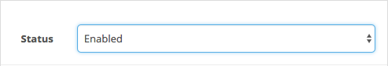
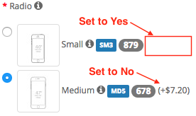
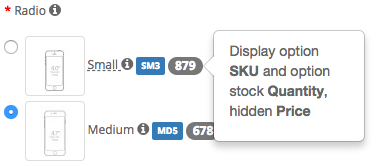

## Welcome

Thank you for purchasing Better Option extension!

This document contains information for **Better Option** extension. If this is not what you are looking for, please go back to [Documentation List](https://opencart.my/documentation).

> If you have any questions that are not found in this documentation, you may contact me through email from the [Support](#support) section at the bottom.

### Extension Info

#### Better Option

|||
| --- | --- |
| Download Page:                  | <https://www.opencart.com/index.php?route=marketplace/extension/info&extension_id=18692> |
| Latest Version:                 | 2.0.1 ([v1.4 Documentation](https://opencart.my/documentation/boption/)) |
| Release Date:                   | 15th July 2020 |
| Demo:                           | OpenCart v3.0.2.x: <https://demo.opencart.my/betteroption> OpenCart v2.3.0.x: <https://demo.opencart.my/boption2> |
| Author:                         | opencart.my - [More extensions](https://www.opencart.com/index.php?route=marketplace/extension&filter_member=opencart.my) |
| Contact:                        | support@opencart.my |

#### Version Compatiblity

| Better Option version | OpenCart version |
| --- | --- |
| 1.0.1 | 1.5.1, 1.5.1.1, 1.5.1.2, 1.5.1.3 1.5.2, 1.5.2.1 1.5.3, 1.5.3.1 1.5.4, 1.5.4.1 1.5.5, 1.5.5.1 1.5.6, 1.5.6.1, 1.5.6.2, 1.5.6.3, 1.5.6.4 |
| 1.3.1 | 2.0.0.0, 2.0.1.0, 2.0.1.1, 2.0.2.0, 2.0.3.1 2.1.0.1, 2.1.0.2 |
| 1.3.2 | 2.2.0.0 |
| 1.4 ([v1.4 Documentation](https://opencart.my/documentation/boption/)) | 2.3.0.0, 2.3.0.1, 2.3.0.2 |
| 2.0.1 | 3.0.0.0, 3.0.1.1, 3.0.1.2, 3.0.2.0, 3.0.3.0, 3.0.3.1, 3.0.3.2, 3.0.3.3 |

## Features

### Overview

#### Enable extra features and enhancements on product options.

Better Option enables store owner to enhance product options with extra features such as option descriptions, option SKU, set default option value, hide option price, show option stock quantity, set minimum order quantity, and replace product image with option image.

### Highlights

1. Add option & option value descriptions.
2. Add option value SKU (searchable).
3. Set default option value.
4. Hide option price.
5. Show option stock quantity.
6. Set minimum order quantity.
7. Replace product image with option image.
8. Works well with the following extensions:
 - [Live Price Update](https://www.opencart.com/index.php?route=marketplace/extension/info&extension_id=12489) extension.
 - [Global Fixed Quantity](https://www.opencart.com/index.php?route=marketplace/extension/info&extension_id=1886) extension.
 - [Option Discount](https://www.opencart.com/index.php?route=marketplace/extension/info&extension_id=1888) extension.

### What's New in v2.0.1

1. Fixed hard-coded table prefix in admin model. [See changelog](#changelog)

2. Removed unused code.

3. Added better compatibility with [Option Discount](https://www.opencart.com/index.php?route=marketplace/extension/info&extension_id=1888) extension.

## Installation

### Prerequisite

1. OpenCart version must be a compatible version. Please refer to the [Version Compatiblity](#version-compatiblity) table above.

### Install

1. Login as admin to your store administration back-end.

2. Navigate to `Extensions` \> `Installer`.

  

3. Click on the `Upload` button and browse the extension file **myoc.betteroption.ocmod.zip** that you have downloaded from your purchase on opencart.com marketplace.

  

4. Once `Install Progress` is successful, navigate to `Extensions` \> `Extensions` \> under `Choose the extension type` \> select **Modules**.

  

5. Under `Modules`, look for the `Module Name` **OpenCart.my Extension Installer** and check if it has been installed. Otherwise, just click on the green <button class="docute-button docute-button-success"><i class="fa fa-plus-circle"></i></button> button to install it.

6. After that, you should see the list of **OpenCart.my Extensions** automatically loaded on your page. Otherwise, just refresh the page by navigating to `Extensions` \> `Extensions` \> under `Choose the extension type` \> select **OpenCart.my Extensions**.

  

7. Under `OpenCart.my Extensions`, look for the `Module Name` **Better Option** and click on the green <button class="docute-button docute-button-success"><i class="fa fa-plus-circle"></i></button> button to install it.

8. After installation is successful, you may click on the blue <button class="docute-button docute-button-primary"><i class="fa fa-pencil"></i></button> button to start using **Better Option** extension. (See [Usage](#usage))

  

## Update

### From v1.x to v2.0.x

Previous versions of this extension are not compatible with OpenCart v3.0.x. Therefore, a new installation is required.

### From v2.0.0 to v2.0.1

  **WARNING!** DO NOT need to uninstall the Better Option extension from admin > Extensions > Extensions > OpenCart.my Extensions > Better Option! Or else you will lose all your Better Option data that you have previously setup.

1. Follow the uninstall instructions under the [Uninstall - Option B](#option-b-uninstall-and-delete-all-extension-files) section \> **Step 2** below to remove the **Better Option** extension files from your store.

2. Reupload the latest extension file `myoc.betteroption.ocmod.zip` that you have downloaded from the opencart.com marketplace **Better Option** [extension page](https://www.opencart.com/index.php?route=marketplace/extension/info&extension_id=12489).

3. Navigate to `Extensions` \> `Modifications` \> click on the blue <button class="docute-button docute-button-primary"><i class="fa fa-refresh"></i></button> **Refresh** button.

## Usage

### Add New

Click on the blue <button class="docute-button docute-button-primary"><i class="fa fa-plus"></i></button> **Add New** button to start creating Better Option entry.

  

### Status

  

`Enable` or `Disable` this Better Option entry.

### Sort Order

Enter a numerical value to sort Better Option by order. When 2 or more Better Option with the same Option Value is matched with a product, the one with the higher sort order(lower value) will be selected to use.

  

### Option Value

Select an Option Value to apply Better Option features. You may search by Option name or Option Value name.

  

### SKU

Set a SKU value for this Option Value. This value is searchable from the OpenCart default search feature on the strore front header.

  

Example:

  

### Set as Default

If set to Yes, this option value will be pre-selected when the product page loads.

  

Example:

  

### Hide Option Price(in brackets)

If set to Yes, option price will be hidden on the product page.

  

Example:

  

### Show Option Stock

Show the stock quantity of the selected option value.

  

Example:

  

### Minimum Order

Set a minimum order quantity for this option value.

  

For example, the option value "Radio: Small" Minimum Quantity is set to 4 but there's only 1 in cart, prompting OpenCart to issue a warning to customer and preventing them from checkout.

  

### Replace Product Image

If set to Yes, the product main image on product page will be replaced by this option value's image upon selection by customer.

  

Example:

  

### Product

Assign this Better Option value to specific products. Only selected products with the added Option Value will display Better Option features.

  

### Category

Assign this Better Option value to products under specific categories. Only products in selected categories with the added Option Value will display Better Option features.

  

### Manufacturer

Assign this Better Option value to products under specific manufacturers(brands). Only products in selected manufacturers with the added Option Value will display Better Option features.

  

### Login Required

Activate this Better Option value only when customers are logged in.

  

### Customer Group

  

Activate this Better Option value only to selected customer groups. Requires **Login Required** setting above to be set to `Yes`.

### Store

  

Better Option features for this Option Value will only appear if the current store matches with any of the selected stores here. Therefore, **at least 1** store must be selected for this Better Option features to appear.

### Save

Once you are done, click on the blue <button class="docute-button docute-button-primary"><i class="fa fa-save"></i></button> button on the top right of the form to save your entry.

## Managing Better Option

After saving your Better Option entry, you can manage them on the previous Better Option list page with the buttons on the top right corner of the page.

  

### Viewing

Click on the table headers to sort the Better Option entries by **Option Value** or **SKU** in the table.

  

### Copy

To make a copy of your Better Option entries, simply select them by checking the checkbox and click the white <button class="docute-button docute-button-default"><i class="fa fa-copy"></i></button> **Copy** button.

  

### Delete

To delete your Better Option entries, simply select them by checking the checkbox and click the red <button class="docute-button docute-button-danger"><i class="fa fa-trash-o"></i></button> **Delete** button. A confirmation window will appear to confirm on the delete action.

  

## Options Description

Click on the **Options Description** tab to edit Options Description.

Please note that Option Description will be applied to all instances of that particular option or option value in any product that has added the same option or option value.

  

### Add New Option Description

You may add any text, HTML, or any rich text content such as hyperlink, image, or video as the Option Description content for each language that your store has.

  

### Edit Option Description

  

Hovering your mouse cursor above Option name on the store-front product page will reveal the Option Description content in a popover. Example:

  

### Edit Option Value Description

You may add any text, HTML, or any rich text content such as hyperlink, image, or video as the Option Value Description content for each option value in each language that your store has.

  

Hovering your mouse cursor above Option Value name on the store-front product page will reveal the Option Value Description content in a popover. Example:

  

### Save

Once you are done, click on the blue <button class="docute-button docute-button-primary"><i class="fa fa-save"></i></button> button on the top right of the form to save your entry.

### Viewing

On the Options Description page, click on the table headers to sort the Option Description entries by **Option Name** or **Option Type** in the table.

  

### Delete

To delete an Option Description entries, go back to the previous Option Description list page and simply select them by checking the checkbox and click the red <button class="docute-button docute-button-danger"><i class="fa fa-trash-o"></i></button> **Delete** button. A confirmation window will appear to confirm on the delete action.

  

## Customization

### Custom Language

Better Option readily supports multiple languages on the store front. Just enter the text content under your desired language tab in the Option Description and they will be displayed according to selected language on the store front.

To add additional language support to the admin, please perform the following steps (assuming `zh-cn` is the custom language folder name):

#### Admin Back-end

1. Make a copy of the following file:
`/admin/language/en-gb/extension/myoc/better_option.php`

2. Paste it into your custom language folder(you may need to create the folder `myoc` manually):
`/admin/language/zh-cn/extension/myoc/better_option.php`

3. Open and edit the newly copied file:
`/admin/language/zh-cn/extension/myoc/better_option.php`

4. Edit the text in the file to your custom language accordingly.

#### Custom Theme

Better Option extension modifies front-end product page template file(`catalog/view/theme/*/template/product/product.twig`) in order to replace the option and option value with additional enhancements. Therefore, further code modifications may be required to integrate it with a 3rd party custom theme on a case-by-case basis. In such cases, you may contact us to request for [customization service](#professional-service).

## Troubleshoot / FAQ

**Q: Better Option is not appearing on the product page.**

A1: Please clear your theme and modification cache:

> Login to your store admin and navigate to `Dashboard` \> click on the blue <button class="docute-button docute-button-primary"><i class="fa fa-cog"></i></button> **Settings** button \> click on the orange <button class="docute-button docute-button-warning"><i class="fa fa-refresh"></i></button> **Refresh** buttons to refresh both `Theme` & `SASS` Components \> close the **Developer Settings** window.

> Then, navigate to `Extensions` \> `Modifications` \> click on the blue <button class="docute-button docute-button-primary"><i class="fa fa-refresh"></i></button> **Refresh** button.

A2: Please make sure you have set the extension settings properly in your admin. The following settings can cause Better Option not appearing on the product page:

> * Status is Disabled.
> * Product is not selected or does not falls under the selected Categories or Manufacturers set in your Better Option entry settings.
> * Customer Group is selected but customer is not logged in on store front.
> * Required Store is not selected.
> * Option Description is empty or not set for that particular option or option value.

> Please see [Usage](#usage) section for detailed settings instruction.

## Uninstall

### Option A: Uninstall only

Please follow the steps below if you want to temporary disable **Better Option** extension from your store but plan to reinstall later.

1. Login as admin to your store administration back-end.

2. Navigate to `Extensions` \> `Extensions` \> under `Choose the extension type` \> select **OpenCart.my Extensions**.

3. Under `OpenCart.my Extensions`, look for the `Module Name` **Better Option** and click on the red <button class="docute-button docute-button-danger"><i class="fa fa-minus-circle"></i></button> button to uninstall it.

  **WARNING!** All Better Option entries and Option Descriptions data will be completely deleted from your store!

  

### Option B: Uninstall and delete all extension files

Please follow the steps below to completely uninstall and delete **Better Option** extension files from your store.

  **WARNING!** All extension files and configuration settings data will be completely deleted from your store!

1. Follow the steps above in the [Option A: Uninstall only](#option-a-uninstall-only) section to uninstall the extension.

2. In your store admin, navigate to `Extensions` \> `Installer` \> `Install History` \> under `Filename`, look for `myoc.betteroption.ocmod.zip` entry and click on the red <button class="docute-button docute-button-danger"><i class="fa fa-trash-o"></i></button> button to completely delete all **Better Option** extension files.

  

  Please **DO NOT** uninstall and delete the `myoc.installer.ocmod.zip` entry above, as it is required for you to access all other existing OpenCart.my (myoc) extensions that you might have installed and currently in use on your store.

## Changelog

| Version | Release Date | Features |
| --- | --- | --- |
| v2.0.1 | 15th July 2020 | 1. Fixed hard-coded table prefix in admin model. 2. Removed unused code. 3. Added better compatibility with [Option Discount](https://www.opencart.com/index.php?route=marketplace/extension/info&extension_id=1888) extension. |
| v2.0.0 | 24th September 2018 | 1. Support for latest OpenCart v3.0.x. 2. Ability to show option value stock quantity. |

## Support

### Questions & Troubleshooting

If you have any questions regarding this extension or require troubleshooting support, please email to `support@opencart.my`

Please include the following in your email:

1. **URL** to the page on your store or **screenshots** showing the issue or error.
2. A temporary admin login to your OpenCart store administration with full **access** & **modify** permissions.
3. A temporary **FTP login** to your store host server with read & write permission.

### Professional Service

We provide a variety of professional services for your OpenCart store.

- Extension Customization
- Extension Integration with other 3rd party extensions
- Custom Theme Integration

Please email your request to `support@opencart.my` to see how we can help you.

### Comments and Feedbacks

You can always post your comments, feedback, or any suggestion on the extension page here: <https://www.opencart.com/index.php?route=marketplace/extension/info&extension_id=18692>
