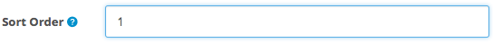

## Welcome

Thank you for purchasing Custom Menu extension!

This document contains information for **Custom Menu** extension. If this is not what you are looking for, please go back to [Documentation List](https://opencart.my/documentation).

> If you have any questions that are not found in this documentation, you may contact me through email from the [Support](#support) section at the bottom.

### Extension Info

#### Custom Menu

|||
| --- | --- |
| Download Page:                  | <https://www.opencart.com/index.php?route=marketplace/extension/info&extension_id=6074> |
| Latest Version:                 | 2.0.1 ([v1.7.x Documentation](https://opencart.my/documentation/cmenu)) |
| Release Date:                   | 7th July 2018 |
| Demo:                           | OpenCart v3.0.2.x: <https://demo.opencart.my/custommenu> OpenCart v2.3.0.x: <https://demo.opencart.my/cmenu2> |
| Author:                         | opencart.my - [More extensions](https://www.opencart.com/index.php?route=marketplace/extension&filter_member=opencart.my) |
| Contact:                        | support@opencart.my |

#### Version Compatiblity

| Custom Menu version | OpenCart version |
| --- | --- |
| 1.6 | 1.5.0, 1.5.0.1, 1.5.0.2, 1.5.0.3, 1.5.0.4, 1.5.0.5 1.5.1, 1.5.1.1, 1.5.1.2, 1.5.1.3 1.5.2, 1.5.2.1 1.5.3, 1.5.3.1 1.5.4, 1.5.4.1 1.5.5, 1.5.5.1 1.5.6, 1.5.6.1, 1.5.6.2, 1.5.6.3, 1.5.6.4 |
| 1.7.4 | 2.0.0.0, 2.0.1.0, 2.0.1.1, 2.0.2.0, 2.0.3.1 |
| 1.7.5 | 2.1.0.1, 2.1.0.2 |
| 1.7.6 | 2.2.0.0 |
| 1.7.7 ([v1.7.x Documentation](https://opencart.my/documentation/cmenu/)) | 2.3.0.0, 2.3.0.1, 2.3.0.2 |
| 2.0.0 2.0.1 | 3.0.0.0, 3.0.1.1, 3.0.1.2, 3.0.2.0, 3.0.3.0, 3.0.3.1, 3.0.3.2, 3.0.3.3 |

## Features

### Overview

#### Add custom links onto the top menu

Custom Menu enables store owner to add own custom links in the top navigation menu as well as in the category module.

### Highlights

1. Any type of link can be added including internal and external links, as well as empty links(#).
2. Custom links can be configured to appear alongside with existing category links on the top menu, or in the category module.
3. Custom links can be sorted with existing category links.
4. Custom link can be a child of another custom link or any existing category link.
5. Custom link can be limited to certain customer groups.
6. Custom link can be limited to certain languages.
7. Multi-languages supported.
10. Multi-store supported.
11. SEO URL supported.

### What's New in v2.0.1

1. Fixed uninstall modification. [See changelog](#changelog)

2. Removed event and cache control.

3. Added Add New button on empty result list page.

## Installation

### Prerequisite

1. OpenCart version must be a compatible version. Please refer to the [Version Compatiblity](#version-compatiblity) table above.

### Install

1. Login as admin to your store administration back-end.

2. Navigate to `Extensions` \> `Installer`.

  

3. Click on the `Upload` button and browse the extension file **myoc.cmenu.ocmod.zip** that you have downloaded from your purchase on opencart.com marketplace.

  

4. Once `Install Progress` is successful, navigate to `Extensions` \> `Extensions` \> under `Choose the extension type` \> select **Modules**.

  

5. Under `Modules`, look for the `Module Name` **OpenCart.my Extension Installer** and check if it has been installed. Otherwise, just click on the green <button class="docute-button docute-button-success"><i class="fa fa-plus-circle"></i></button> button to install it.

6. After that, you should see the list of **OpenCart.my Extensions** automatically loaded on your page. Otherwise, just refresh the page by navigating to `Extensions` \> `Extensions` \> under `Choose the extension type` \> select **OpenCart.my Extensions**.

  

7. Under `OpenCart.my Extensions`, look for the `Module Name` **Custom Menu** and click on the green <button class="docute-button docute-button-success"><i class="fa fa-plus-circle"></i></button> button to install it.

8. After installation is successful, you may click on the blue <button class="docute-button docute-button-primary"><i class="fa fa-pencil"></i></button> button to start using **Custom Menu** extension. (See [Usage](#usage))

  

## Update

### From v1.x to v2.0.x

Previous versions of this extension are not compatible with OpenCart v3.0.x. Therefore, a new installation is required.

### From v2.0.0 to v2.0.1

Please follow the steps below to update **Custom Menu** extension. Your extension settings & data will not be deleted.

  **WARNING!** Please DO NOT uninstall the Custom Menu extension from admin > Extensions > Extensions > OpenCart.my Extensions > Custom Menu! Or else you will lose all your Custom Menu data that you have previously setup.

1. Click on the `Upload` button and browse the new extension file **myoc.cmenu.ocmod.zip** that you have downloaded from your purchase on opencart.com marketplace.

  

  This will replace previous extension files with the updated version.

2. Then, navigate to `Extensions` \> `Modifications` \> click on the blue <button class="docute-button docute-button-primary"><i class="fa fa-refresh"></i></button> **Refresh** button.

3. Clear your theme cache by navigating to `Dashboard` \> click on the blue <button class="docute-button docute-button-primary"><i class="fa fa-cog"></i></button> **Settings** button \> click on the orange <button class="docute-button docute-button-warning"><i class="fa fa-refresh"></i></button> **Refresh** buttons to refresh both `Theme` & `SASS` Components \> close the **Developer Settings** window.

4. If necessary, reconfigure and save the extension settings in the extension configuration page in admin > `Extensions` \> `Extensions` \> under `Choose the extension type` \> select `OpenCart.my Extensions` > `Custom Menu` > click on the blue <button class="docute-button docute-button-primary"><i class="fa fa-pencil"></i></button> **Edit** button.

## Usage

### Add New

Click on the blue <button class="docute-button docute-button-primary"><i class="fa fa-plus"></i></button> **Add New** button to start creating custom links.

### Status

  

`Enable` or `Disable` this Custom Menu entry.

### Name

  

Insert a name for the Custom Menu entry. This name will appear as is on the [top navigation menu](#show-in-top-navigation)(if enabled) and [category module](#show-in-category-module)(if enabled) according to language chosen.

Example result:

  

### Link

Insert the custom link **full URL** here. It is recommended to include `https://` or `https://` in a link. Examples: https://www.amazon.com, https://gmail.google.com

To create a false or empty link, just insert a hash `#` symbol.

Alternatively, you can use the shortcut link selection below to insert internal links to your store. Just select from the drop down list of **Routes**, **Informations**, **Categories**, **Products**(select a category first), & **Manufacturers** and the link will be automatically inserted into the link text field above them.

  

#### About SEO URL

Links will be automatically displayed as SEO URL if it's available and enabled in your store settings.

#### Hiding Existing Category Links
Category links can still be managed under `Catalog` > `Categories` in your admin. You can hide all original category links from the top navigation menu by navigating to `Catalog` > `Categories` > `Edit` any unwanted category > under `Data` tab > uncheck **Top** checkbox > `Save`.

### Parent Link

Select a parent link if you want to make this link appears as a child link.

  

Example result:

  

### Parent Category

Select a parent category link if you want to make this link appears as a child link under existing top category link. Can be set together with Parent Link.

  

Example result:

  

### Sort Order

Enter a numerical value to sort link by order.

  

This value is affected by the sort order in categories. This means that you can sort a link in any order in the top menu even between existing categories.

Alternatively, links can be easily sorted on the previous link list page:

  

Just enter the desired **Sort Order** value and click on the blue <button class="docute-button docute-button-primary"><i class="fa fa-save"></i></button> button on the top right of the page.

### Columns

Number of columns for child links. Works just like the Column setting in category setting. Only works for top links in the top navigation menu on OpenCart's default theme, or in 3rd party themes that support columns in their top navigation menu.

  

Example result:

  

### Open link in new window

Set link to open in a new window.

  

### Show in Top Navigation

Set link to appear on the top navigation main menu.

  

### Show in Category Module

Set link to appear on the Category module.

  

Example result:

  

### Login Required

Set link to appear only when customers are logged in.

  

### Customer Group

  

Set link to appear only to selected customer groups. Requires **Login Required** setting above to be set to `Yes`.

### Language

  

Set link to appear only when specific language is selected on the store front by customers.

### Store

  

Any store selected here will become a rule for this Custom Menu entry. This Custom Menu entry will only appear if the current store matches with any of the selected stores here. Therefore, **at least 1** store must be selected for this Custom Menu entry to appear.

### Save

Once you are done, click on the blue <button class="docute-button docute-button-primary"><i class="fa fa-save"></i></button> button on the top right of the form to save your entry.

## Managing Links

After saving your links, you can manage them on the previous links list page with the buttons on the top right corner of the page.

  

### Viewing

Click on the table headers to sort the links by **Name** and **Sort Order** in the table.

  

### Copy

To make a copy of your links, simply select them by checking the checkbox and click the white <button class="docute-button docute-button-default"><i class="fa fa-copy"></i></button> **Copy** button.

  

### Delete

To delete your links, simply select them by checking the checkbox and click the red <button class="docute-button docute-button-danger"><i class="fa fa-trash-o"></i></button> **Delete** button. A confirmation window will appear to confirm on the delete action.

  

### Sorting

To set the sort order of your links in bulk, simply enter numerical values into the text field under the **Sort Order** column, and click on the blue <button class="docute-button docute-button-primary"><i class="fa fa-save"></i></button> **Save** button.

  

## Customization

### Custom Language

To add additional language support, please perform the following steps (assuming `zh-cn` is the custom language folder name):

#### Admin Back-end

1. Make a copy of the following file:
`/admin/language/en-gb/extension/myoc/cmenu.php`

2. Paste it into your custom language folder(you may need to create the folder `myoc` manually):
`/admin/language/zh-cn/extension/myoc/cmenu.php`

3. Open and edit the newly copied file:
`/admin/language/zh-cn/extension/myoc/cmenu.php`

4. Edit the text in the file to your custom language accordingly.

#### Store Front

Custom Menu extension readily supports multi languages. There's no extra modification required.

  

Just enter the relevant name for each custom language installed on your store, and it will be displayed on the top menu according to customer's selected language on the store front.

### Custom Theme

Custom Menu should work in any custom theme that uses OpenCart's default categories variables. Else, further customization may be required. In such cases, you may contact us to request for [customization service](#professional-service).

## Troubleshoot / FAQ

**Q: Links are not appearing on top navigation menu.**

> A1: Please make sure you have set the extension settings properly in your admin. The following settings can cause Custom Menu to not appear on top menu:

> * Status is Disabled.
> * Customer Group is selected but customer is not logged in on store front.
> * Required Store is not selected.
> * Required language does not matched with selected language on the store front.
> * Too many links in the navigation menu, causing them to be hidden off menu or off screen.

> Please see Usage section for detailed settings instruction.

## Uninstall

### Option A: Uninstall only

Please follow the steps below if you want to temporary disable **Custom Menu** extension from your store but plan to reinstall later.

1. Login as admin to your store administration back-end.

2. Navigate to `Extensions` \> `Extensions` \> under `Choose the extension type` \> select **OpenCart.my Extensions**.

3. Under `OpenCart.my Extensions`, look for the `Module Name` **Custom Menu** and click on the red <button class="docute-button docute-button-danger"><i class="fa fa-minus-circle"></i></button> button to uninstall it.

  **WARNING!** All Custom Menu entries will be completely deleted from your store!

  

### Option B: Uninstall and delete all extension files

Please follow the steps below to completely uninstall and delete **Custom Menu** extension files from your store.

  **WARNING!** All extension files and configuration settings data will be completely deleted from your store!

1. Follow the steps above in the [Option A: Uninstall only](#option-a-uninstall-only) section to uninstall the extension.

2. In your store admin, navigate to `Extensions` \> `Installer` \> `Install History` \> under `Filename`, look for `myoc.cmenu.ocmod.zip` entry and click on the red <button class="docute-button docute-button-danger"><i class="fa fa-trash-o"></i></button> button to completely delete all **Custom Menu** extension files.

  

  Please **DO NOT** uninstall and delete the `myoc.installer.ocmod.zip` entry above, as it is required for you to access all other existing OpenCart.my (myoc) extensions that you might have installed and currently in use on your store.

## Changelog

| Version | Release Date | Features |
| --- | --- | --- |
| v2.0.1 | 7th July 2018 | 1. Fixed uninstall modification 2. Removed event and cache control 3. Added Add New button on empty result list page. |
| v2.0.0 | 30th June 2018 | 1. Support for latest OpenCart v3.0.x 2. Enabled **Top** settings for child categories in top menu. |

## Support

### Questions & Troubleshooting

If you have any questions regarding this extension or require troubleshooting support, please email to `support@opencart.my`

Please include the following in your email:

1. **URL** to the page on your store or **screenshots** showing the issue or error.
2. A temporary admin login to your OpenCart store administration with full **access** & **modify** permissions.
3. A temporary **FTP login** to your store host server with read & write permission.

### Professional Service

We provide a variety of professional services for your OpenCart store.

- Extension Customization
- Extension Integration with other 3rd party extensions
- Custom Theme Integration

Please email your request to `support@opencart.my` to see how we can help you.

### Comments and Feedbacks

You can always post your comments, feedback, or any suggestion on the extension page here: <https://www.opencart.com/index.php?route=marketplace/extension/info&extension_id=6074>
