## Welcome

Thank you for purchasing Custom Unit extension!

This document contains information for **Custom Unit** extension. If this is not what you are looking for, please go back to [Documentation List](http://opencart.my/documentation).

> If you have any questions that are not found in this documentation, you may contact me through email from the [Support](#support) section at the bottom.

### Extension Info

#### Custom Unit

|||
| --- | --- |
| Download Page:                  | <https://www.opencart.com/index.php?route=marketplace/extension/info&extension_id=10463> |
| Latest Version:                 | 2.1.1  ([v2.0.0 Documentation](http://opencart.my/documentation/customunit/v200)) ([v1.3.x Documentation](http://opencart.my/documentation/cunit)) |
| Release Date:                   | 17th July 2020 |
| Demo:                           | OpenCart v3.0.2.x: <http://demo.opencart.my/customunit> OpenCart v2.3.0.x: <http://demo.opencart.my/cunit2> |
| Author:                         | opencart.my - [More extensions](https://www.opencart.com/index.php?route=marketplace/extension&filter_member=opencart.my) |
| Contact:                        | support@opencart.my |

#### Version Compatiblity

| Custom Unit version | OpenCart version |
| --- | --- |
| 1.2.1 | 1.5.1, 1.5.1.1, 1.5.1.2, 1.5.1.3 1.5.2, 1.5.2.1 1.5.3, 1.5.3.1 1.5.4, 1.5.4.1 1.5.5, 1.5.5.1 1.5.6, 1.5.6.1, 1.5.6.2, 1.5.6.3, 1.5.6.4 |
| 1.3.5 | 2.0.0.0, 2.0.1.0, 2.0.1.1, 2.0.2.0, 2.0.3.1 2.1.0.1, 2.1.0.2 |
| 1.3.6 | 2.2.0.0 |
| 1.3.9 ([v1.3.x Documentation](http://opencart.my/documentation/cunit/)) | 2.3.0.0, 2.3.0.1, 2.3.0.2 |
| 2.1.1 | 3.0.0.0, 3.0.1.1, 3.0.1.2, 3.0.2.0, 3.0.3.0, 3.0.3.1, 3.0.3.2, 3.0.3.3 |

## Features

### Overview

#### Enable custom quantity unit to be set on each individual product.

Custom Unit enables store owner to define custom quantity unit on products. This extension is useful for products that needs to be collectively purchased in large quantities or simple single quantity units such as measurements.

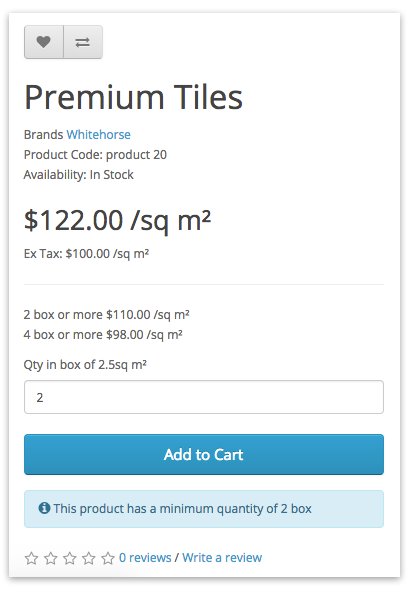

### Highlights

1. A Base Unit and a Collective Unit can be set. For example: a **Carton**(Collective Unit) of 24 **bottles**(Base Unit) Energy Drink.
2. Custom Units with any quantity multiplier can be set, including decimal values.
3. Customer can order in decimal quantity. Useful for products with measurement units such as roll of fabric in inches, or canvas print size in m2.
4. Each custom unit can be applied to individual product or a group of products from a Category or Manufacturer(brand) conveniently.
5. Works best with product discount pricing.
6. Works well with the following extensions:
 - [Live Price Update](https://www.opencart.com/index.php?route=marketplace/extension/info&extension_id=12489) extension.
 - [Global Fixed Quantity](https://www.opencart.com/index.php?route=marketplace/extension/info&extension_id=1886) extension.
 - [Option Discount](https://www.opencart.com/index.php?route=marketplace/extension/info&extension_id=1888) extension.

### What's New in v2.1.1

1. Added caching to improve load performance. [See changelog](#changelog)

2. Fixed the priority of products, categories, and manufacturers.

3. Added decimal quantity support for Global Fixed Quantity extension.

4. Fixed decimal suppport in Live Price Update extension.

## Installation

### Prerequisite

1. OpenCart version must be a compatible version. Please refer to the [Version Compatiblity](#version-compatiblity) table above.

### Install

1. Login as admin to your store administration back-end.

2. Navigate to `Extensions` \> `Installer`.

  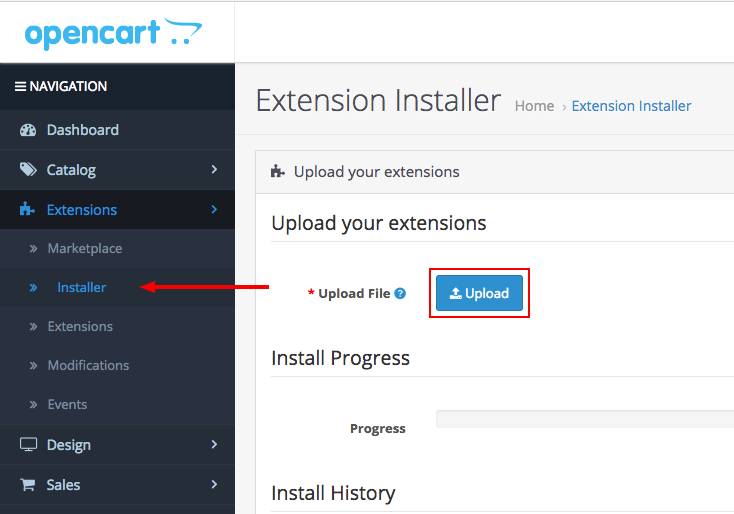

3. Click on the `Upload` button and browse the extension file **myoc.customunit.ocmod.zip** that you have downloaded from your purchase on opencart.com marketplace.

  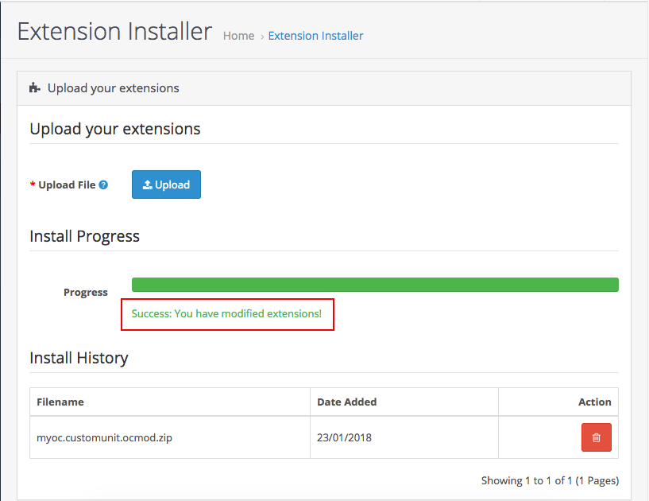

4. Once `Install Progress` is successful, navigate to `Extensions` \> `Extensions` \> under `Choose the extension type` \> select **Modules**.

  

5. Under `Modules`, look for the `Module Name` **OpenCart.my Extension Installer** and check if it has been installed. Otherwise, just click on the green <button class="docute-button docute-button-success"><i class="fa fa-plus-circle"></i></button> button to install it.

6. After that, you should see the list of **OpenCart.my Extensions** automatically loaded on your page. Otherwise, just refresh the page by navigating to `Extensions` \> `Extensions` \> under `Choose the extension type` \> select **OpenCart.my Extensions**.

  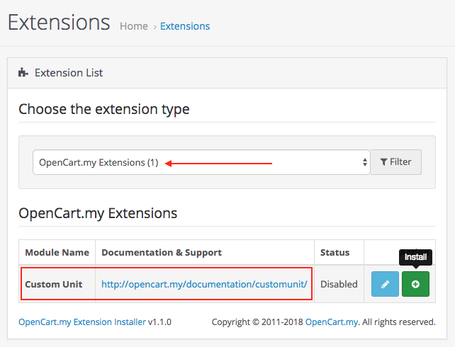

7. Under `OpenCart.my Extensions`, look for the `Module Name` **Custom Unit** and click on the green <button class="docute-button docute-button-success"><i class="fa fa-plus-circle"></i></button> button to install it.

8. After installation is successful, you may click on the blue <button class="docute-button docute-button-primary"><i class="fa fa-pencil"></i></button> button to start using **Custom Unit** extension. (See [Usage](#usage))

  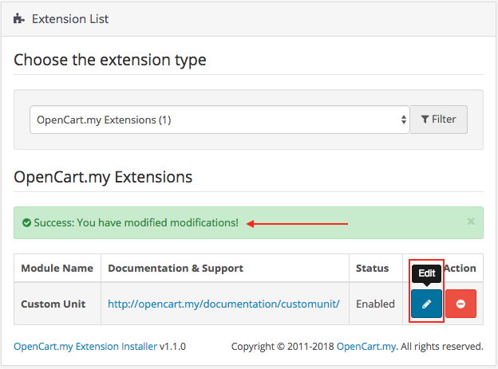

## Upgrade

### From v1.x to v2.0.0

Previous versions of this extension are not compatible with OpenCart v3.0.x. Therefore, a new installation is required.

### From v2.0.0 to v2.1.0, v2.1.1

Please follow the steps below to update **Custom Unit** extension. Your extension settings & data will not be deleted.

  Please **DO NOT** uninstall the **Custom Unit** extension from `admin` \> `Extensions` \> `Extensions` \> `OpenCart.my Extensions`, as doing so will delete all your extension settings & data.

1. Login to your store admin, navigate to `Extensions` \> `Installer` \> `Install History` \> under `Filename`, look for `myoc.customunit.ocmod.zip` entry and click on the red <button class="docute-button docute-button-danger"><i class="fa fa-trash-o"></i></button> button to completely delete all **Custom Unit** extension files. This will not delete your extension settings in database.

  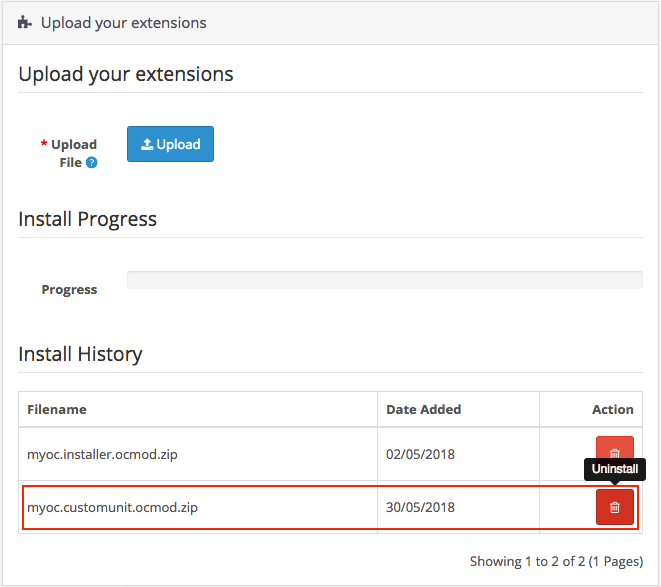

2. Click on the `Upload` button and browse the new extension file **myoc.customunit.ocmod.zip** that you have downloaded from your purchase on opencart.com marketplace.

  

3. Then, navigate to `Extensions` \> `Modifications` \> click on the blue <button class="docute-button docute-button-primary"><i class="fa fa-refresh"></i></button> **Refresh** button.

4. Clear your theme cache by navigating to `Dashboard` \> click on the blue <button class="docute-button docute-button-primary"><i class="fa fa-cog"></i></button> **Settings** button \> click on the orange <button class="docute-button docute-button-warning"><i class="fa fa-refresh"></i></button> **Refresh** buttons to refresh both `Theme` & `SASS` Components \> close the **Developer Settings** window.

## Usage

### Add New

Click on the blue <button class="docute-button docute-button-primary"><i class="fa fa-plus"></i></button> **Add New** button to start creating custom units.

  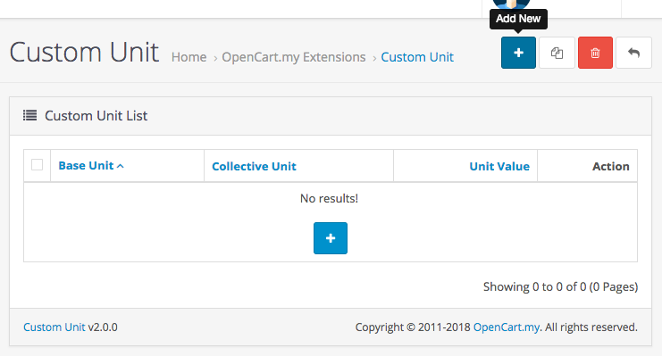

### Status

  

`Enable` or `Disable` this custom unit entry.

### Sort Order

Enter a numerical value to sort custom unit by order. When 2 or more custom unit is matched with a product, the one with the higher sort order(lower value) will be selected to use.

  

### Base Unit

Enter the base unit of your product. It represents the smallest singular unit of your product.

Example: bottle, pcs, m(metre), cm, inch, tab, g(gram), unit, etc.

(You may insert spacing before and after the unit.)

  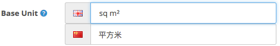

### Collective Unit

Enter the collective unit of your product. It should represent the grouping or collection of your product.

Example: box, carton, set, pack, case, dozen, group, etc.

(You may insert spacing before and after the unit.)

  

### Unit Value

The actual quantity value of a single unit of your product.

  

Example: a Unit Value of `12` means every collective unit that a customer orders will equal to **12** actual unit of the product.
If the product cost **$10** per unit, means 1 collective unit will cost the customer $10 x 12 = **$120**.
12 units will then be subtracted from the product stock quantity.

More [examples](#examples) below.

### Allow Decimal Quantity

If set to **Yes**, customer will be allowed to order product in decimal quantity in cart.

  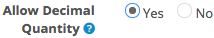

However, do keep in mind that OpenCart will still handle cart quantities in integer numbers internally. Therefore, you need to set:
1. [**Order Unit**](#order-unit) to **Collective Unit**.
2. the correct multiples of 10 in **Unit Value** for the precision point you want.

Example:

| Unit Value (only multiples of 10 allowed) | Decimal places/precision allowed |
| --- | --- |
| 1    | 1     |
| 10   | 1.2   |
| 100  | 1.23  |
| 1000 | 1.234 |

Please see more pricing setup [examples](#examples) below.

### Display Price

Set prices to display in Base Unit or Collective Unit.

  

Example result:

  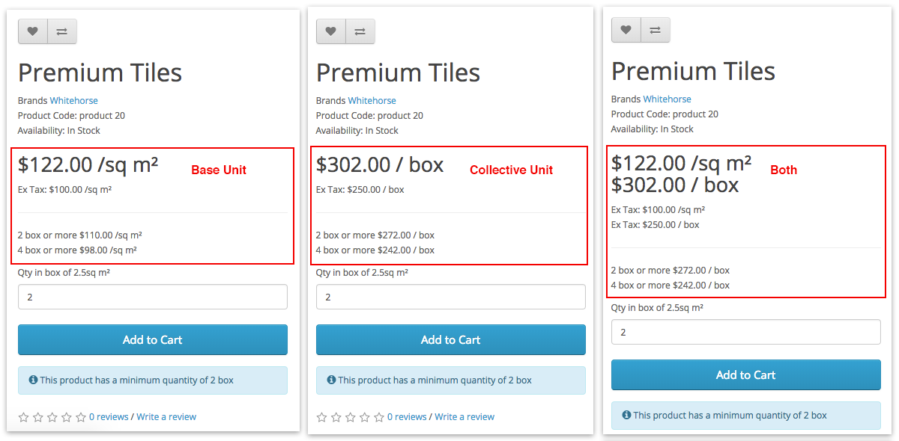

These prices and their custom unit will also be displayed on other parts of your store that has product display such as on Category page, Manufacturer product list page, Search result page, Related products, Special products page, as well as in Bestseller, Featured, Latest, and Special modules if they are being used.

### Order Unit

Set which unit will customer order in.

  

Example result:

  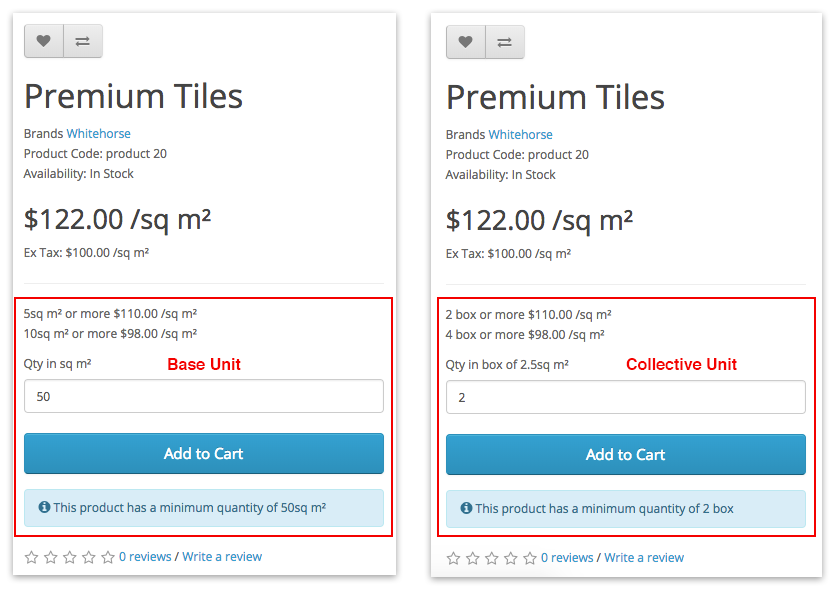

### Product

Assign this custom unit to specific products.

  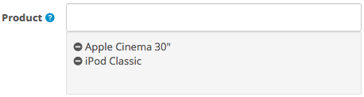

### Category

Assign this custom unit to products under specific categories.

  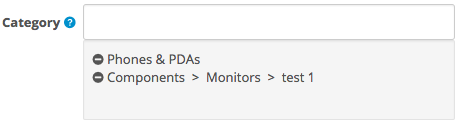

### Manufacturer

Assign this custom unit to products under specific manufacturers(brands).

  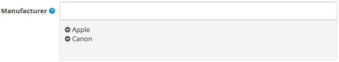

### Login Required

Activate this custom unit only when customers are logged in.

  

### Customer Group

  

Activate this custom unit only to selected customer groups. Requires **Login Required** setting above to be set to `Yes`.

### Store

  

This Custom Unit entry will only appear if the current store matches with any of the selected stores here. Therefore, **at least 1** store must be selected for this Custom Unit entry to appear.

### Save

Once you are done, click on the blue <button class="docute-button docute-button-primary"><i class="fa fa-save"></i></button> button on the top right of the form to save your entry.

## Examples

| Product Price | Base Unit | Collective Unit | Unit Value | Display Price: Base | Display Price: Collective | Cart Quantity | Cart Total (Order Unit: Base) | Cart Total: (Order Unit: Collective) |
| --- | --- |
| $10.00 | m2      | (empty) | 0.1 | $10 /m2    | $1.00                       | 1   | $10.00 | $1.00   |
| $10.00 | m2      | (empty) | 1   | $10 /m2    | $10.00                      | 1   | $10.00 | $10.00  |
| $10.00 | m2      | (empty) | 2.5 | $10 /m2    | $25.00                      | 1   | $10.00 | $25.00  |
| $10.00 | m2      | (empty) | 10  | $10 /m2    | $100.00                     | 1   | $10.00 | $100.00 |
| $10.00 | m2      | (empty) | 10  | $10 /m2    | $100.00                     | 2.5 | $25.00 | $250.00 |

| Product Price | Base Unit | Collective Unit | Unit Value | Display Price: Base | Display Price: Collective | Cart Quantity | Cart Total (Order Unit: Base) | Cart Total: (Order Unit: Collective) |
| --- | --- |
| $10.00 | (empty) | pack    | 0.1 | $10.00        | $1   / pack                 | 1   | $10.00 | $1.00   |
| $10.00 | (empty) | pack    | 1   | $10.00        | $10  / pack                 | 1   | $10.00 | $10.00  |
| $10.00 | (empty) | pack    | 2.5 | $10.00        | $25  / pack                 | 1   | $10.00 | $25.00  |
| $10.00 | (empty) | pack    | 10  | $10.00        | $100 / pack                 | 1   | $10.00 | $100.00 |
| $10.00 | (empty) | pack    | 10  | $10.00        | $100 / pack                 | 2.5 | $25.00 | $250.00 |

| Product Price | Base Unit | Collective Unit | Unit Value | Display Price: Base | Display Price: Collective | Cart Quantity | Cart Total (Order Unit: Base) | Cart Total: (Order Unit: Collective) |
| --- | --- |
| $10.00 | bottle  | carton  | 0.1 | $10 / bottle  | $1   / carton of 0.1 bottle | 1   | $10.00 | $1.00   |
| $10.00 | bottle  | carton  | 1   | $10 / bottle  | $10  / carton of 1   bottle | 1   | $10.00 | $10.00  |
| $10.00 | bottle  | carton  | 2.5 | $10 / bottle  | $25  / carton of 2.5 bottle | 1   | $10.00 | $25.00  |
| $10.00 | bottle  | carton  | 10  | $10 / bottle  | $100 / carton of 10  bottle | 1   | $10.00 | $100.00 |
| $10.00 | bottle  | carton  | 10  | $10 / bottle  | $100 / carton of 10  bottle | 2.5 | $25.00 | $250.00 |

| Product Price | Base Unit | Collective Unit | Unit Value | Display Price: Base | Display Price: Collective | Cart Quantity | Cart Total (Order Unit: Base) | Cart Total: (Order Unit: Collective) |
| --- | --- |
| $10.00 | sq m2 | box     | 0.1 | $10 / sq m2 | $1   / box of 0.1 sq m2     | 1   | $10.00 | $1.00   |
| $10.00 | sq m2 | box     | 1   | $10 / sq m2 | $10  / box of 1   sq m2     | 1   | $10.00 | $10.00  |
| $10.00 | sq m2 | box     | 2.5 | $10 / sq m2 | $25  / box of 2.5 sq m2     | 1   | $10.00 | $25.00  |
| $10.00 | sq m2 | box     | 10  | $10 / sq m2 | $100 / box of 10  sq m2     | 1   | $10.00 | $100.00 |
| $10.00 | sq m2 | box     | 10  | $10 / sq m2 | $100 / box of 10  sq m2     | 2.5 | $25.00 | $250.00 |

## Managing Custom Unit

After saving your custom unit entry, you can manage them on the previous custom unit list page with the buttons on the top right corner of the page.

  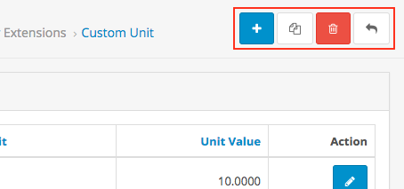

### Viewing

Click on the table headers to sort the custom unit entries by **Base Unit**, **Collective Unit**, or **Unit Value** in the table.

  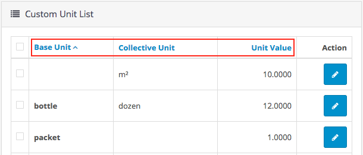

### Copy

To make a copy of your custom unit entries, simply select them by checking the checkbox and click the white <button class="docute-button docute-button-default"><i class="fa fa-copy"></i></button> **Copy** button.

  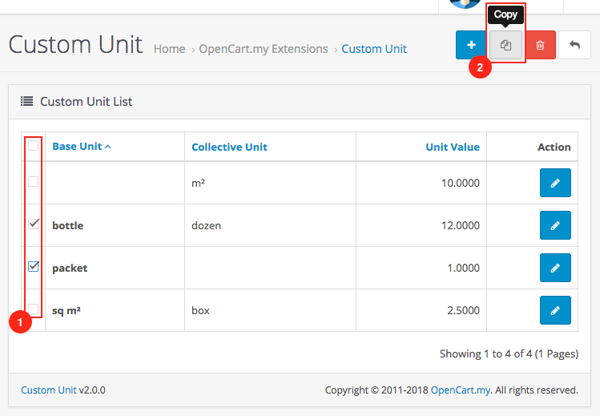

### Delete

To delete your custom unit entries, simply select them by checking the checkbox and click the red <button class="docute-button docute-button-danger"><i class="fa fa-trash-o"></i></button> **Delete** button. A confirmation window will appear to confirm on the delete action.

  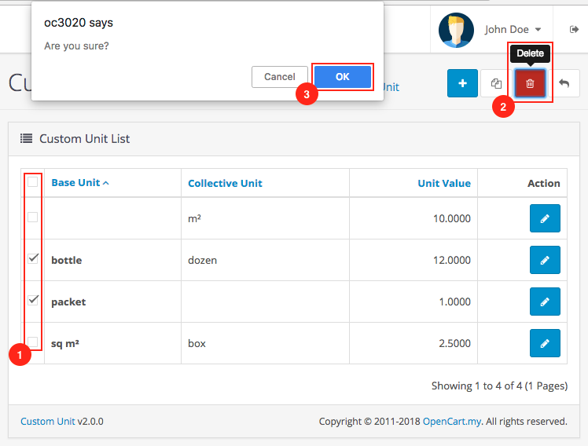

## Customization

### Custom Language

To add additional language support, please perform the following steps (assuming `zh-cn` is the custom language folder name):

#### Admin Back-end

1. Make a copy of the following file:
`/admin/language/en-gb/extension/myoc/cunit.php`

2. Paste it into your custom language folder(you may need to create the folder `myoc` manually):
`/admin/language/zh-cn/extension/myoc/cunit.php`

3. Open and edit the newly copied file:
`/admin/language/zh-cn/extension/myoc/cunit.php`

4. Edit the text in the file to your custom language accordingly.

#### Custom Theme

Custom Unit extension does not modify any front-end template files directly. It uses OpenCart Event System to override certain variables and values on your store before they are displayed on the front-end. However, if any issue shall arise, you may contact us to request for [customization service](#professional-service).

## Troubleshoot / FAQ

**Q: Custom Unit is not appearing on the product page or other product list pages.**

A1: Please clear your theme and modification cache:

> Login to your store admin and navigate to `Dashboard` \> click on the blue <button class="docute-button docute-button-primary"><i class="fa fa-cog"></i></button> **Settings** button \> click on the orange <button class="docute-button docute-button-warning"><i class="fa fa-refresh"></i></button> **Refresh** buttons to refresh both `Theme` & `SASS` Components \> close the **Developer Settings** window.

> Then, navigate to `Extensions` \> `Modifications` \> click on the blue <button class="docute-button docute-button-primary"><i class="fa fa-refresh"></i></button> **Refresh** button.

A2: Please make sure you have set the extension settings properly in your admin. The following settings can cause Custom Unit not appearing on the product page:

> * Status is Disabled.
> * Product is not selected or does not falls under the selected Categories or Manufacturers set in your custom unit entry settings.
> * Customer Group is selected but customer is not logged in on store front.
> * Required Store is not selected.

> Please see [Usage](#usage) section for detailed settings instruction.

## Uninstall

### Option A: Uninstall only

Please follow the steps below if you want to temporary disable **Custom Unit** extension from your store but plan to reinstall later.

1. Login as admin to your store administration back-end.

2. Navigate to `Extensions` \> `Extensions` \> under `Choose the extension type` \> select **OpenCart.my Extensions**.

3. Under `OpenCart.my Extensions`, look for the `Module Name` **Custom Unit** and click on the red <button class="docute-button docute-button-danger"><i class="fa fa-minus-circle"></i></button> button to uninstall it.

  

    **WARNING!** All Custom Unit entries will be completely deleted from your store!
  

  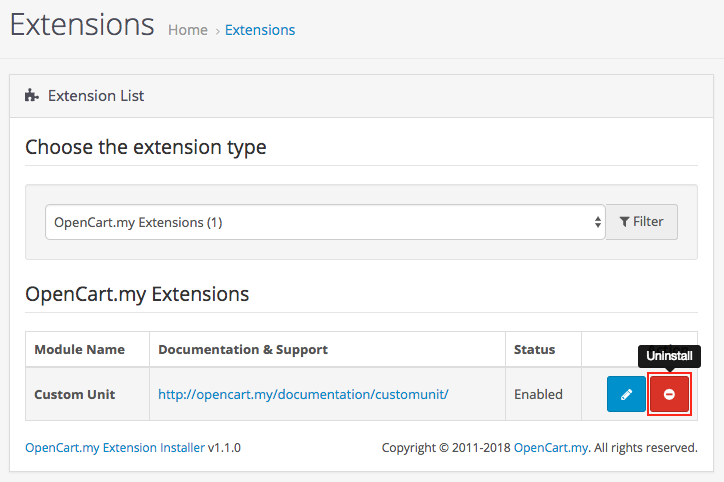

### Option B: Uninstall and delete all extension files

Please follow the steps below to completely uninstall and delete **Custom Unit** extension files from your store.

  **WARNING!** All extension files and configuration settings data will be completely deleted from your store!

1. Follow the steps above in the [Option A: Uninstall only](#option-a-uninstall-only) section to uninstall the extension.

2. In your store admin, navigate to `Extensions` \> `Installer` \> `Install History` \> under `Filename`, look for `myoc.customunit.ocmod.zip` entry and click on the red <button class="docute-button docute-button-danger"><i class="fa fa-trash-o"></i></button> button to completely delete all **Custom Unit** extension files.

  

  

    Please **DO NOT** uninstall and delete the `myoc.installer.ocmod.zip` entry above, as it is required for you to access all other existing OpenCart.my (myoc) extensions that you might have installed and currently in use on your store.
  

## Changelog

| Version | Release Date | Features |
| --- | --- | --- |
| v2.1.1 | 17th July 2020 | 1. Added caching to improve load performance. 2. Fixed the priority of products, categories, and manufacturers. 3. Added decimal quantity support for Global Fixed Quantity extension. 4. Fixed decimal suppport in Live Price Update extension. |
| v2.1.0 | 22nd October 2018 | 1. Product price no longer changes when display price or order in Base Unit, providing simpler pricing setup. 2. No longer need to adjust product price to accommodate correct pricing when using Decimal quantity. 3. Decimal quantity's precision will determined by the Custom Unit Value. 4. Improved Live Price Update integration. Both Base price & Collective price will be shown. 5. Improved Global Fixed Quantity integration. Quantity set values will now be used regardless of Order In setting. |
| v2.0.0 | 12th August 2018 | 1. Support for latest OpenCart v3.0.x. 2. Ability to set product display price in Base Unit or Collective Unit. 3. Ability to set order unit in Base Unit or Collective Unit. 4. Code modification no longer required to use decimal values in order quantity. 5. Custom Unit will be displayed in discount prices. 6. Assign Custom Unit entries based on Manufacturer(Brand). 7. Limit Custom Unit entries with Customer Group and Store. |

## Support

### Questions & Troubleshooting

If you have any questions regarding this extension or require troubleshooting support, please email to `support@opencart.my`

Please include the following in your email:

1. **URL** to the page on your store or **screenshots** showing the issue or error.
2. A temporary admin login to your OpenCart store administration with full **access** & **modify** permissions.
3. A temporary **FTP login** to your store host server with read & write permission.

### Professional Service

We provide a variety of professional services for your OpenCart store.

- Extension Customization
- Extension Integration with other 3rd party extensions
- Custom Theme Integration

Please email your request to `support@opencart.my` to see how we can help you.

### Comments and Feedbacks

You can always post your comments, feedback, or any suggestion on the extension page here: <https://www.opencart.com/index.php?route=marketplace/extension/info&extension_id=10463>
