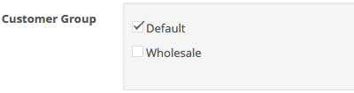

## Welcome

Thank you for purchasing Global Fixed Quantity extension!

This document contains information for **Global Fixed Quantity** extension. If this is not what you are looking for, please go back to [Documentation List](https://opencart.my/documentation).

> If you have any questions that are not found in this documentation, you may contact me through email from the [Support](#support) section at the bottom.

### Extension Info

#### Global Fixed Quantity

|||
| --- | --- |
| Download Page:                  | <https://www.opencart.com/index.php?route=marketplace/extension/info&extension_id=1886> |
| Latest Version:                 | 2.0.1 ([v1.6.x Documentation](https://opencart.my/documentation/globalqty/v1)) |
| Release Date:                   | 16th July 2020 |
| Demo:                           | OpenCart v3.0.2.x: <https://demo.opencart.my/globalqty2> OpenCart v2.3.0.x: <https://demo.opencart.my/globalqty> |
| Author:                         | opencart.my - [More extensions](https://www.opencart.com/index.php?route=marketplace/extension&filter_member=opencart.my) |
| Contact:                        | support@opencart.my |

#### Version Compatiblity

| Global Fixed Quantity version | OpenCart version |
| --- | --- |
| 1.0 (legacy) | 1.4.8.x, 1.4.9.x |
| 1.5.2 | 1.5.1, 1.5.1.1, 1.5.1.2, 1.5.1.3 1.5.2, 1.5.2.1 1.5.3, 1.5.3.1 1.5.4, 1.5.4.1 1.5.5, 1.5.5.1 1.5.6, 1.5.6.1, 1.5.6.2, 1.5.6.3, 1.5.6.4 |
| 1.6.3 | 2.0.0.0, 2.0.1.0, 2.0.1.1, 2.0.2.0, 2.0.3.1 |
| 1.6.5 | 2.1.0.1, 2.1.0.2 |
| 1.6.6 | 2.2.0.0 |
| 1.6.8 ([v1.6.x Documentation](https://opencart.my/documentation/globalqty/)) | 2.3.0.0, 2.3.0.1, 2.3.0.2 |
| 2.0.1 | 3.0.0.0, 3.0.1.1, 3.0.1.2, 3.0.2.0, 3.0.3.0, 3.0.3.1, 3.0.3.2, 3.0.3.3 |

## Features

### Overview

#### Enable quantity to be displayed as drop-down menu or radio buttons.

Global Fixed Quantity enables store owner to define a fixed set of quantities and display them on product page as drop-down menu or radio buttons for convenient quantity selection by customers.

### Highlights

1. Replace product quantity text input field as drop-down menu or radio buttons.
2. Quantity set can be globally configured and easily assign to products from the admin back-end.
3. Quantity drop-down menu will be displayed on each item in Shopping Cart page.
4. Quantity drop-down menu can be displayed in product modules such as Bestseller, Featured, Latest, and Special modules, as well as in Category page, Manufacturer product list, Search result page, in related product list, and Special product list page.
5. Customer will not be able to choose any other quantity outside of the quantity set, unless allowed to in the settings.
6. Customer Groups and Multi-stores supported.
7. Works well with the following extensions:
  - [Live Price Update](https://www.opencart.com/index.php?route=marketplace/extension/info&extension_id=12489) extension.
  - [Better Option](https://www.opencart.com/index.php?route=marketplace/extension/info&extension_id=18692) extension.
  - [Option Discount](https://www.opencart.com/index.php?route=marketplace/extension/info&extension_id=1888) extension.

### What's New in v2.0.1

1. Fixed long quantity set overflow in admin table. [See changelog](#changelog)

2. Added clear theme cache upon install.

3. Added compatibility support with [Option Discount](https://www.opencart.com/index.php?route=marketplace/extension/info&extension_id=1888) extension.

## Installation

### Prerequisite

1. OpenCart version must be a compatible version. Please refer to the [Version Compatiblity](#version-compatiblity) table above.

### Install

1. Login as admin to your store administration back-end.

2. Navigate to `Extensions` \> `Installer`.

  

3. Click on the `Upload` button and browse the extension file **myoc.globalqty.ocmod.zip** that you have downloaded from your purchase on opencart.com marketplace.

  

4. Once `Install Progress` is successful, navigate to `Extensions` \> `Extensions` \> under `Choose the extension type` \> select **Modules**.

  

5. Under `Modules`, look for the `Module Name` **OpenCart.my Extension Installer** and check if it has been installed. Otherwise, just click on the green <button class="docute-button docute-button-success"><i class="fa fa-plus-circle"></i></button> button to install it.

6. After that, you should see the list of **OpenCart.my Extensions** automatically loaded on your page. Otherwise, just refresh the page by navigating to `Extensions` \> `Extensions` \> under `Choose the extension type` \> select **OpenCart.my Extensions**.

  

7. Under `OpenCart.my Extensions`, look for the `Module Name` **Global Fixed Quantity** and click on the green <button class="docute-button docute-button-success"><i class="fa fa-plus-circle"></i></button> button to install it.

8. After installation is successful, you may click on the blue <button class="docute-button docute-button-primary"><i class="fa fa-pencil"></i></button> button to start using **Global Fixed Quantity** extension. (See [Usage](#usage))

  

## Update

### From v1.x to v2.0.x

Previous versions of this extension are not compatible with OpenCart v3.0.x. Therefore, a new installation is required.

### From v2.0.0 to v2.0.1

  **WARNING!** DO NOT need to uninstall the Global Fixed Quantity extension from admin > Extensions > Extensions > OpenCart.my Extensions > Global Fixed Quantity! Or else you will lose all your Global Fixed Quantity data that you have previously setup.

1. Follow the uninstall instructions under the [Uninstall - Option B](#option-b-uninstall-and-delete-all-extension-files) section \> **Step 2** below to remove the **Global Fixed Quantity** extension files from your store.

2. Reupload the latest extension file `myoc.globalqty.ocmod.zip` that you have downloaded from the opencart.com marketplace **Global Fixed Quantity** [extension page](https://www.opencart.com/index.php?route=marketplace/extension/info&extension_id=12489).

3. Navigate to `Extensions` \> `Modifications` \> click on the blue <button class="docute-button docute-button-primary"><i class="fa fa-refresh"></i></button> **Refresh** button.

## Usage

### Add New

Click on the blue <button class="docute-button docute-button-primary"><i class="fa fa-plus"></i></button> **Add New** button to start creating a quantity set entry.

  

### Status

  

`Enable` or `Disable` this quantity set entry.

### Sort Order

Enter a numerical value to sort quantity set by order. When 2 or more quantity set is matched with a product, the one with the higher sort order(lower value) will be selected to use.

  

### Quantity Set

Enter the desired quantity values in comma separated format. Positive integers only. Multilines are acceptable.

E.g. `2, 4, 6, 8, 10,12,14`

E.g. `5,10,15,20,25,50,100,200,500,1000,2000,5000`

E.g. 
`3,6,9,12 15,20,25,30 40,50,100,200`

  

### Thousands Separator

Pick a thousand separator style for values 1000 and higher.

  

### View Style

Select a display style for this quantity set.

  

Example result:

Left: Drop-down List / Right: Table

  

### Allow Custom Maximum Quantity

Allow customer to input custom quantity value when they select the highest fixed quantity value. The highest quantity will be appended with a `+` symbol to indicate as such.

  

Example result:

  

### Disable Quantity Without Stock

Disable quantity selection when quantity for a product is not available in stock.

  

Example result:

  

### Display Out of Stock Status

Display 'Out of Stock' message for quantities not available in stock.

  

Example result:

  

### Hide Default Discount List

Hide the default discount price list on product page

  

Example: Set to **Yes** to hide the discount price list inside the red box.

  

### Display Total Base Price

Display the total product base price. The price includes only the base price of the product without any option prices.

  

Example:

  

### Display Price Per Item

Display the price per single product item.

  

Example:

  

### Display Discount(%)

Display the amount discounted in percentage (%). The discount amount is based on discount prices set in a product edit page under the **Discount** tab.

  

Example:

  

### Display "You Save"

Display amount less from product base price. (Price - Discount)

  

Example:

  

### Display Price With Tax

Set prices to include or exclude tax.

  

### Display Quantity Drop Down on Product List Pages & Modules

Display quantity drop-down list on product list pages & modules such as on Category page, Manufacturer product list page, search result page, related products, special products page, as well as in Bestseller, Featured, Latest, and Special modules.

  

Example(The product on the right contains the quantity drop-down list for quantity selection before adding to cart):

  

### Product

Assign this quantity set to specific products.

  

### Category

Assign this quantity set to products under specific categories.

  

### Manufacturer

Assign this quantity set to products under specific manufacturers(brands).

  

### Login Required

Set this quantity set to appear only when customers are logged in.

  

### Customer Group

  

Set this quantity set to appear only to selected customer groups. Requires **Login Required** setting above to be set to `Yes`.

### Store

  

This Global Fixed Quantity entry will only appear if the current store matches with any of the selected stores here. Therefore, **at least 1** store must be selected for this Global Fixed Quantity entry to appear.

### Save

Once you are done, click on the blue <button class="docute-button docute-button-primary"><i class="fa fa-save"></i></button> button on the top right of the form to save your entry.

## Managing Quantity Set

After saving your quantity set entry, you can manage them on the previous quantity set list page with the buttons on the top right corner of the page.

  

### Viewing

Click on the table headers to sort the quantity set entries by **Quantity Set** and **View Style** in the table.

  

### Copy

To make a copy of your quantity set entries, simply select them by checking the checkbox and click the white <button class="docute-button docute-button-default"><i class="fa fa-copy"></i></button> **Copy** button.

  

### Delete

To delete your quantity set entries, simply select them by checking the checkbox and click the red <button class="docute-button docute-button-danger"><i class="fa fa-trash-o"></i></button> **Delete** button. A confirmation window will appear to confirm on the delete action.

  

## Customization

### Custom Language

To add additional language support, please perform the following steps (assuming `zh-cn` is the custom language folder name):

#### Admin Back-end

1. Make a copy of the following file:
`/admin/language/en-gb/extension/myoc/globalqty.php`

2. Paste it into your custom language folder(you may need to create the folder `myoc` manually):
`/admin/language/zh-cn/extension/myoc/globalqty.php`

3. Open and edit the newly copied file:
`/admin/language/zh-cn/extension/myoc/globalqty.php`

4. Edit the text in the file to your custom language accordingly.

#### Custom Theme

Global Fixed Quantity extension modifies front-end template files in order to replace the text quantity field with a drop-down list. Therefore, further code modifications may be required to integrate it with a 3rd party custom theme on a case-by-case basis. In such cases, you may contact us to request for [customization service](#professional-service).

## Troubleshoot / FAQ

**Q: Quantity drop-down list is not appearing on the product page or other product list pages.**

A1: Please clear your theme and modification cache:

> Login to your store admin and navigate to `Dashboard` \> click on the blue <button class="docute-button docute-button-primary"><i class="fa fa-cog"></i></button> **Settings** button \> click on the orange <button class="docute-button docute-button-warning"><i class="fa fa-refresh"></i></button> **Refresh** buttons to refresh both `Theme` & `SASS` Components \> close the **Developer Settings** window.

> Then, navigate to `Extensions` \> `Modifications` \> click on the blue <button class="docute-button docute-button-primary"><i class="fa fa-refresh"></i></button> **Refresh** button.

A2: Please make sure you have set the extension settings properly in your admin. The following settings can cause Global Fixed Quantity set to not appear on the product page:

> * Status is Disabled.
> * Product is not selected or does not falls under the selected Categories or Manufacturers set in your quantity set settings.
> * Customer Group is selected but customer is not logged in on store front.
> * Required Store is not selected.
> * Your store is using a non-compatible 3rd party custom theme.

> Please see [Usage](#usage) section for detailed settings instruction.

A3: If you have modified the following template files from the store admin \> `Design` \> **Theme Editor**, then Global Fixed Quantity will be override by the edit and won't be able to work properly:

> * `/catalog/view/theme/*/template/product/product.twig`
> * `/catalog/view/theme/*/template/checkout/cart.twig`
> * `/catalog/view/theme/*/template/extension/module/bestseller.twig`
> * `/catalog/view/theme/*/template/extension/module/featured.twig`
> * `/catalog/view/theme/*/template/extension/module/latest.twig`
> * `/catalog/view/theme/*/template/extension/module/special.twig`
> * `/catalog/view/theme/*/template/product/category.twig`
> * `/catalog/view/theme/*/template/product/manufacturer_info.twig`
> * `/catalog/view/theme/*/template/product/search.twig`
> * `/catalog/view/theme/*/template/product/special.twig`

> Currently there's no solution for Modification to modify **Theme Editor's** edited template files. It is recommended that you edit the template files directly from the source, or use the OCMOD modification method to do so.

## Uninstall

### Option A: Uninstall only

Please follow the steps below if you want to temporary disable **Global Fixed Quantity** extension from your store but plan to reinstall later.

1. Login as admin to your store administration back-end.

2. Navigate to `Extensions` \> `Extensions` \> under `Choose the extension type` \> select **OpenCart.my Extensions**.

3. Under `OpenCart.my Extensions`, look for the `Module Name` **Global Fixed Quantity** and click on the red <button class="docute-button docute-button-danger"><i class="fa fa-minus-circle"></i></button> button to uninstall it.

  

    **WARNING!** All Global Fixed Quantity entries will be completely deleted from your store!
  

  

### Option B: Uninstall and delete all extension files

Please follow the steps below to completely uninstall and delete **Global Fixed Quantity** extension files from your store.

  **WARNING!** All extension files and configuration settings data will be completely deleted from your store!

1. Follow the steps above in the [Option A: Uninstall only](#option-a-uninstall-only) section to uninstall the extension.

2. In your store admin, navigate to `Extensions` \> `Installer` \> `Install History` \> under `Filename`, look for `myoc.globalqty.ocmod.zip` entry and click on the red <button class="docute-button docute-button-danger"><i class="fa fa-trash-o"></i></button> button to completely delete all **Global Fixed Quantity** extension files.

  

  

    Please **DO NOT** uninstall and delete the `myoc.installer.ocmod.zip` entry above, as it is required for you to access all other existing OpenCart.my (myoc) extensions that you might have installed and currently in use on your store.
  

## Changelog

| Version | Release Date | Features |
| --- | --- | --- |
| v2.0.1 | 16th July 2020 | 1. Fixed long quantity set overflow in admin table. 2. Added clear theme cache upon install. 3. Added compatibility support with [Option Discount](https://www.opencart.com/index.php?route=marketplace/extension/info&extension_id=1888) extension. |
| v2.0.0 | 27th July 2018 | 1. Support for latest OpenCart v3.0.x 2. Allow customer to input custom quantity value when they select the highest fixed quantity value. 3. Disable quantity selection when quantity is not available in stock. 4. Display 'Out of Stock' message for quantities not available in stock. 5. Option to display price with or without tax. 6. Assign Global Quantity entries based on Manufacturer(Brand). |

## Support

### Questions & Troubleshooting

If you have any questions regarding this extension or require troubleshooting support, please email to `support@opencart.my`

Please include the following in your email:

1. **URL** to the page on your store or **screenshots** showing the issue or error.
2. A temporary admin login to your OpenCart store administration with full **access** & **modify** permissions.
3. A temporary **FTP login** to your store host server with read & write permission.

### Professional Service

We provide a variety of professional services for your OpenCart store.

- Extension Customization
- Extension Integration with other 3rd party extensions
- Custom Theme Integration

Please email your request to `support@opencart.my` to see how we can help you.

### Comments and Feedbacks

You can always post your comments, feedback, or any suggestion on the extension page here: <https://www.opencart.com/index.php?route=marketplace/extension/info&extension_id=1886>
