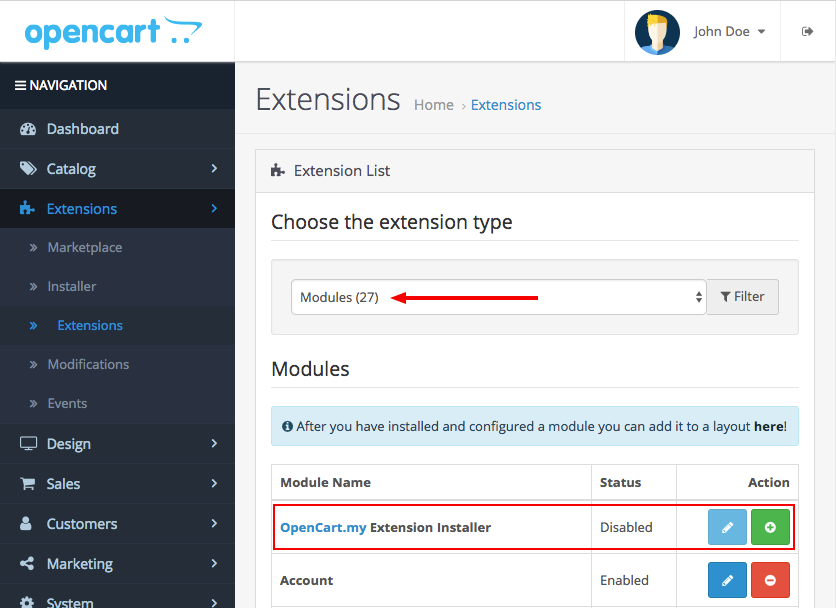
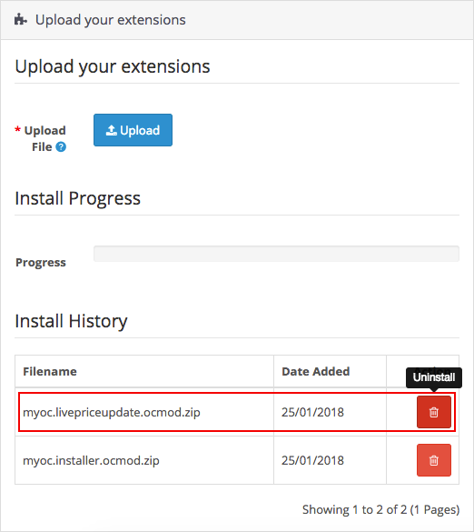

## Welcome

Thank you for purchasing Live Price Update extension!

This document contains information for **Live Price Update** extension. If this is not what you are looking for, please go back to [Documentation List](https://opencart.my/documentation).

> If you have any questions that are not found in this documentation, you may contact me through email from the [Support](#support) section at the bottom.

### Extension Info

#### Live Price Update

||
| --- |
| Download Page:                  | <https://www.opencart.com/index.php?route=marketplace/extension/info&extension_id=12489> |
| Latest Version:                 | 2.0.2 ([v1.5.x Documentation](v1/)) |
| Release Date:                   | 15th July 2020 |
| Demo:                           | OpenCart v3.0.2.x: <https://demo.opencart.my/livepriceupdate><br>OpenCart v2.3.0.x: <https://demo.opencart.my/livepriceupdate2><br>OpenCart v1.5.x: <https://demo.opencart.my/lpu> |
| Author:                         | opencart.my - [More extensions](https://www.opencart.com/index.php?route=marketplace/extension&filter_member=opencart.my) |
| Contact:                        | support@opencart.my |

#### Version Compatiblity

| Live Price Update version | OpenCart version |
| --- | --- |
| 1.5.4 | 1.5.0, 1.5.0.1, 1.5.0.2, 1.5.0.3, 1.5.0.4, 1.5.0.5<br>1.5.1, 1.5.1.1, 1.5.1.2, 1.5.1.3<br>1.5.2, 1.5.2.1<br>1.5.3, 1.5.3.1<br>1.5.4, 1.5.4.1<br>1.5.5, 1.5.5.1<br>1.5.6, 1.5.6.1, 1.5.6.2, 1.5.6.3, 1.5.6.4 |
| 1.5.5 | 2.0.0.0, 2.0.1.0, 2.0.1.1, 2.0.2.0, 2.0.3.1 |
| 1.5.6 | 2.1.0.1, 2.1.0.2 |
| 1.5.7<br>([v1.5.x Documentation](v1/)) | v2.2.0.0, 2.3.0.0, 2.3.0.1, 2.3.0.2 |
| 2.0.0, 2.0.1, 2.0.2 | 3.0.0.0, 3.0.1.1, 3.0.1.2, 3.0.2.0, 3.0.3.0, 3.0.3.1, 3.0.3.2, 3.0.3.3 |

## Features

### Overview

This extension provides live price change on product page upon options selection or quantity change.


### Highlights

1. Works with the following major quantity & options extensions:
 * Global Quantity (https://www.opencart.com/index.php?route=marketplace/extension/info&extension_id=1886)
 * Product Option Discount (https://www.opencart.com/index.php?route=marketplace/extension/info&extension_id=1888)
 * Option Combination (https://www.opencart.com/index.php?route=marketplace/extension/info&extension_id=3706)

2. Plug & Play. Minimal configurations(optional) required.

### What's New in v2.0.2

1. Fixed extension appearing multiple times on multiple theme templates. [See changelog](#changelog)

## Installation

### Prerequisite

1. OpenCart version must be a compatible version. Please refer to the [Version Compatiblity](#version-compatiblity) table above.

2. PHP version 5.5+ and above.

### Install

1. Login as admin to your store administration back-end.

2. Navigate to `Extensions` \> `Installer`.

  

3. Click on the `Upload` button and browse the extension file **myoc.livepriceupdate.ocmod.zip** that you have downloaded from your purchase on opencart.com marketplace.

  

4. Once `Install Progress` is successful, navigate to `Extensions` \> `Extensions` \> under `Choose the extension type` \> select **Modules**.

  

5. Under `Modules`, look for the `Module Name` **OpenCart.my Extension Installer** and check if it has been installed. Otherwise, just click on the green <button class="docute-button docute-button-success"><i class="fa fa-plus-circle"></i></button> button to install it.

6. After that, you should see the list of **OpenCart.my Extensions** automatically loaded on your page. Otherwise, just refresh the page by navigating to `Extensions` \> `Extensions` \> under `Choose the extension type` \> select **OpenCart.my Extensions**.

  

7. Under `OpenCart.my Extensions`, look for the `Module Name` **Live Price Update** and click on the green <button class="docute-button docute-button-success"><i class="fa fa-plus-circle"></i></button> button to install it.

8. After installation is successful, you may click on the blue <button class="docute-button docute-button-primary"><i class="fa fa-pencil"></i></button> button to start configuring your **Live Price Update** extension. (See [Usage](#usage))

  

## Update

### From v1.x to v2.0.x

Previous versions of this extension are not compatible with OpenCart v3.0.x. Therefore, a new installation is required.

### From v2.0.0, v2.0.1 to v2.0.2

Please follow the steps below to update **Live Price Update** extension. Your extension settings & data will not be deleted.

<p class="danger">
  Please **DO NOT** uninstall the **Live Price Update** extension from `admin` \> `Extensions` \> `Extensions` \> `OpenCart.my Extensions`, as doing so will delete all your extension settings & data.
</p>

1. Click on the `Upload` button and browse the new extension file **myoc.livepriceupdate.ocmod.zip** that you have downloaded from your purchase on opencart.com marketplace.

  

  This will replace previous extension files with the updated version.

2. Then, navigate to `Extensions` \> `Modifications` \> click on the blue <button class="docute-button docute-button-primary"><i class="fa fa-refresh"></i></button> **Refresh** button.

3. Clear your theme cache by navigating to `Dashboard` \> click on the blue <button class="docute-button docute-button-primary"><i class="fa fa-cog"></i></button> **Settings** button \> click on the orange <button class="docute-button docute-button-warning"><i class="fa fa-refresh"></i></button> **Refresh** buttons to refresh both `Theme` & `SASS` Components \> close the **Developer Settings** window.

4. If necessary, reconfigure and save the extension settings in the extension configuration page in admin > `Extensions` \> `Extensions` \> under `Choose the extension type` \> select `OpenCart.my Extensions` > `Live Price Update` > click on the blue <button class="docute-button docute-button-primary"><i class="fa fa-pencil"></i></button> **Edit** button.

## Usage

### Status

  

`Enable` or `Disable` the extension.

### Fade Duration

  

Set the duration of fade animation for price change on product page.

Value in milliseconds. `1000 = 1 second`. Set to `0` to disable fading effect.

## Customization

### Custom Language

To add additional language support, please perform the following steps (assuming 'zh-cn' is the custom language folder name):

#### Admin Back-end

1. Make a copy of the following file:
`/admin/language/en-gb/extension/myoc/live_price_update.php`

2. Paste it into your custom language folder(you may need to create the folder `myoc` manually):
`/admin/language/zh-cn/extension/myoc/live_price_update.php`

3. Open and edit the newly copied file:
`/admin/language/zh-cn/extension/myoc/live_price_update.php`

4. Edit the text in the file to your custom language accordingly.

#### Store Front

1. Make a copy of the following file:
`/catalog/language/en-gb/extension/myoc/live_price_update.php`

2. Paste it into your custom language folder(you may need to create the folder `myoc` manually):
`/catalog/language/zh-cn/extension/myoc/live_price_update.php`

3. Open and edit the newly copied file:
`/catalog/language/zh-cn/extension/myoc/live_price_update.php`

4. Edit the text in the file to your custom language accordingly, but leave the entries with `false` values untouch, and use OpenCart's own **Language Editor** to edit the text instead, which will be explained in the following [Custom Text](#custom-text) section.

### Custom Text

Assuming you are having 100% discount on certain products with $0.00 as their price, you can customize the price to display a text instead.

  

1. Login as admin to your store administration back-end.

2. Navigate to `Design` \> `Language Editor`.

  

3. Click on the blue <button class="docute-button docute-button-primary"><i class="fa fa-plus-circle"></i></button> button to add a new traslation entry.

4. On the **Add Translation** form, select the following:

| Field | Value |
| --- | --- |
| Store | *Default* |
| Language | *English* (Or other languages available on your store) |
| Route | `extension/myoc/live_price_update` |
| Key | *Refer to the key mappings from the first screenshot above in this section.* |
| Default | *Reference to the original value* |
| Value | *You may enter any text that you want to display for the price update when prices = $0.00* |

  

5 . Once you are done, click on the blue <button class="docute-button docute-button-primary"><i class="fa fa-save"></i></button> button on the top right of the form to save your entry.

6 . You may repeat the steps above to add more entries for other language text.

### Custome Theme

If you are using a custom theme with customized quantity input field such as the following examples, **Live Price Update** might not work properly when the stepper buttons are clicked.

  

To fix this issue, further code modification is required:

1. Locate the javascript code on your custom theme template files or javascript files that control the quantity stepper buttons. They may be situated in `/catalog/view/theme/[your_custom_theme_folder]/template/product.tpl`, or they could be in a separate `.js` file in `/catalog/view/javascript/` .

2. Look for the function that controls the increment/decrement of quantity value. Usually they will be named as `up()`/`down()`, `stepUp()`/`stepDown()`, `inc()`/`dec()`, or they could be in a single function such as `updateQty()` etc.

3. Call the **Live Price Update** function `myocLivePriceUpdate();` inside the control functions found in step 2 on the last line before the function closing curly braces. Example:

  ```javascript
  function up() {
    // original code here..

    //insert code on the last line to trigger live price update after quantity change
    myocLivePriceUpdate();
  }

  function down() {
    // original code here..

    //insert code on the last line to trigger live price update after quantity change
    myocLivePriceUpdate();
  }
  ```

4. Clear all store and browser cache to test it.

> You may also request for paid integration support service by sending an email to [Support](#support).

## Troubleshoot / FAQ

**Q. Price is not updating.**

A1: Please make sure that you have downloaded and installed the correct **Live Price Update** extension version for your OpenCart store version. You may refer to the [Version Compatibility](#version-compatiblity) table above.

A2: Please make sure that you have installed **Live Price Update** extension successfully based on the steps outlined in the [Installation](#installation) section above.

A3: Please clear your theme and modification cache:

> Login to your store admin and navigate to `Dashboard` \> click on the blue <button class="docute-button docute-button-primary"><i class="fa fa-cog"></i></button> **Settings** button \> click on the orange <button class="docute-button docute-button-warning"><i class="fa fa-refresh"></i></button> **Refresh** buttons to refresh both `Theme` & `SASS` Components \> close the **Developer Settings** window.

> Then, navigate to `Extensions` \> `Modifications` \> click on the blue <button class="docute-button docute-button-primary"><i class="fa fa-refresh"></i></button> **Refresh** button.

**Q. Price update does not match with price shown on cart.**

> A: You may be using other 3rd party extensions on your store that could be changing cart price calculations. Please contact [support](#support) with more information for further troubleshooting.

**Q. Fatal error: Call to undefined function array_column() in.../admin/controller/extension/module/myoc_installer.php on line 96.**

> A: Please make sure you are running your store on PHP version 5.5+ and above.

## Uninstall

### Option A: Uninstall only

Please follow the steps below if you want to temporary disable **Live Price Update** extension from your store but plan to reinstall later.

1. Login as admin to your store administration back-end.

2. Navigate to `Extensions` \> `Extensions` \> under `Choose the extension type` \> select **OpenCart.my Extensions**.

3. Under `OpenCart.my Extensions`, look for the `Module Name` **Live Price Update** and click on the red <button class="docute-button docute-button-danger"><i class="fa fa-minus-circle"></i></button> button to uninstall it.

  

### Option B: Uninstall and delete all extension files

Please follow the steps below to completely uninstall and delete **Live Price Update** extension files from your store.

<p class="danger">
  **WARNING!** All extension files and configuration settings data will be completely deleted from your store!
</p>

1. Follow the steps above in the [Option A: Uninstall only](#option-a-uninstall-only) section to uninstall the extension.

2. In your store admin, navigate to `Extensions` \> `Installer` \> `Install History` \> under `Filename`, look for `myoc.livepriceupdate.ocmod.zip` entry and click on the red <button class="docute-button docute-button-danger"><i class="fa fa-trash-o"></i></button> button to completely delete all **Live Price Update** extension files.

  

<p class="warning">
  Please **DO NOT** uninstall and delete the `myoc.installer.ocmod.zip` entry above, as it is required for you to access all other existing OpenCart.my (myoc) extensions that you might have installed and currently in use on your store.
</p>

## Changelog

| Version | Release Date | Features |
| --- | --- | --- |
| 2.0.2 | 15th July 2020 | 1. Fixed extension appearing multiple times on multiple theme templates. |
| 2.0.1 | 3rd February 2018 | 1. Fixed select option event firing twice |
| 2.0.0 | 27th January 2018 | 1. Support for latest OpenCart v3.0.x |

## Support

### Questions & Troubleshooting

If you have any questions regarding this extension or require troubleshooting support, please email to `support@opencart.my`

Please include the following in your email:

1. **URL** to the page on your store or **screenshots** showing the issue or error.
2. A temporary admin login to your OpenCart store administration with full **access** & **modify** permissions.
3. A temporary **FTP login** to your store host server with read & write permission.

### Professional Service

We provide a variety of professional services for your OpenCart store.

- Extension Customization
- Extension Integration with other 3rd party extensions
- Custom Theme Integration

Please email your request to `support@opencart.my` to see how we can help you.

### Comments and Feedbacks

You can always post your comments, feedback, or any suggestion on the extension page here: <https://www.opencart.com/index.php?route=marketplace/extension/info&extension_id=12489>
