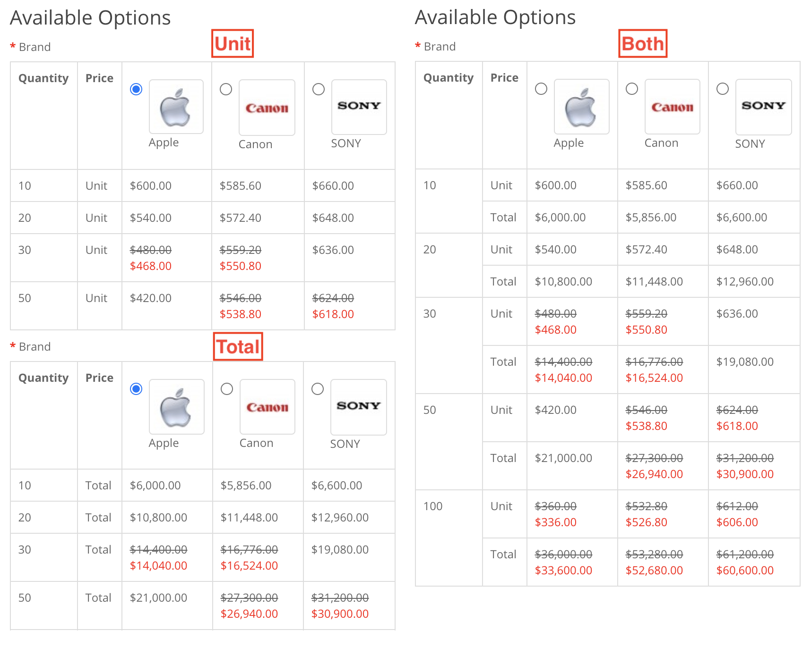
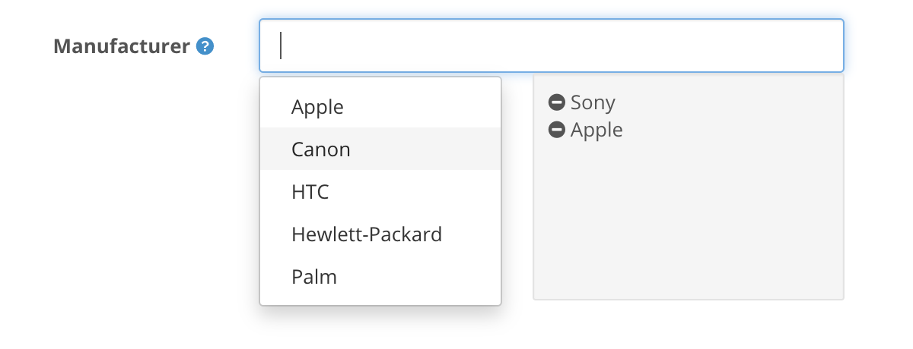
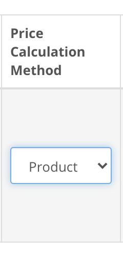

## Welcome

Thank you for purchasing Option Discount extension!

This document contains information for **Option Discount** extension. If this is not what you are looking for, please go back to [Documentation List](https://opencart.my/documentation).

> If you have any questions that are not found in this documentation, you may contact me through email from the [Support](#support) section at the bottom.

### Extension Info

#### Option Discount

|||
| --- | --- |
| Download Page:                  | <https://www.opencart.com/index.php?route=marketplace/extension/info&extension_id=1888> |
| Latest Version:                 | 2.0.0  ([v1.7.5 Documentation](https://opencart.my/documentation/pod)) |
| Release Date:                   | 13th July 2020 |
| Demo:                           | OpenCart v3.0.3.x: <https://demo.opencart.my/optiondiscount> OpenCart v2.3.0.x: <https://demo.opencart.my/pod> |
| Author:                         | opencart.my - [More extensions](https://www.opencart.com/index.php?route=marketplace/extension&filter_member=opencart.my) |
| Contact:                        | support@opencart.my |

#### Version Compatiblity

| Option Discount version | OpenCart version |
| --- | --- |
| 1.0.2 | 1.4.8.x, 1.4.9.x |
| 1.5.3 | 1.5.1, 1.5.1.1, 1.5.1.2, 1.5.1.3 1.5.2, 1.5.2.1 1.5.3, 1.5.3.1 1.5.4, 1.5.4.1 1.5.5, 1.5.5.1 1.5.6, 1.5.6.1, 1.5.6.2, 1.5.6.3, 1.5.6.4 |
| 1.7.5 | 2.0.0.0, 2.0.1.0, 2.0.1.1, 2.0.2.0, 2.0.3.1 2.1.0.1, 2.1.0.2 2.2.0.0 2.3.0.0, 2.3.0.1, 2.3.0.2 |
| 2.0.0 | 3.0.0.0, 3.0.1.1, 3.0.1.2, 3.0.2.0, 3.0.3.0, 3.0.3.1, 3.0.3.2, 3.0.3.3 |

## Features

### Overview

#### Enable quantity discount on product options.

Option Discount enables store owner to setup discount on individual product option values.
This extension is useful if you need to apply quantity discount to each option value in a product.

### Highlights

1. Option Discount prices appear as table format on product page.
2. Able to show option price of each individual option in cart and order.
3. Able to set option price to calculate based on flat rate or quantity.
4. Can be used with existing product quantity discount, special price, tax, and other existing pricing related functionality.
5. Multiple price prefixes to choose from: (`+`, `-`, `=`, `+%`, `-%`)
6. Works well with the following extensions:
 - [Live Price Update](https://www.opencart.com/index.php?route=marketplace/extension/info&extension_id=12489) extension.
 - [Better Option](https://www.opencart.com/index.php?route=marketplace/extension/info&extension_id=18692) extension.
 - [Global Fixed Quantity](https://www.opencart.com/index.php?route=marketplace/extension/info&extension_id=1886) extension.

### What's New in v2.0.0

1. Support for latest OpenCart v3.0.x. [See changelog](#changelog)

2. Option Discount can be set globally and apply to multiple products, categories, or manufacturers.

3. Added improved compatibility with Live Price Update, Better Option, and Global Fixed Quantity extensions.

## Installation

### Prerequisite

1. OpenCart version must be a compatible version. Please refer to the [Version Compatiblity](#version-compatiblity) table above.

### Install

1. Login as admin to your store administration back-end.

2. Navigate to `Extensions` \> `Installer`.

  

3. Click on the `Upload` button and browse the extension file **myoc.optiondiscount.ocmod.zip** that you have downloaded from your purchase on opencart.com marketplace.

  

4. Once `Install Progress` is successful, navigate to `Extensions` \> `Extensions` \> under `Choose the extension type` \> select **Modules**.

  

5. Under `Modules`, look for the `Module Name` **OpenCart.my Extension Installer** and check if it has been installed. Otherwise, just click on the green <button class="docute-button docute-button-success"><i class="fa fa-plus-circle"></i></button> button to install it.

6. After that, you should see the list of **OpenCart.my Extensions** automatically loaded on your page. Otherwise, just refresh the page by navigating to `Extensions` \> `Extensions` \> under `Choose the extension type` \> select **OpenCart.my Extensions**.

  

7. Under `OpenCart.my Extensions`, look for the `Module Name` **Option Discount** and click on the green <button class="docute-button docute-button-success"><i class="fa fa-plus-circle"></i></button> button to install it.

8. After installation is successful, you may click on the blue <button class="docute-button docute-button-primary"><i class="fa fa-pencil"></i></button> button to start using **Option Discount** extension. (See [Usage](#usage))

  

## Upgrade

### From v1.x to v2.0.0

Previous versions of this extension are not compatible with OpenCart v3.0.x. Therefore, a new installation is required.

## Usage

### Add New

1. Select an Option to add Option Discount by entering the Option name in the text field.

  

2. Click on the blue <button class="docute-button docute-button-primary"><i class="fa fa-plus"></i></button> **Add New** button to create a new option discount entry.

### Option

  

Under the `Settings` tab, confirm that the Option field is showing the Option name that you want to add discount to.

### Status

  

`Enable` or `Disable` this option discount entry.

### Sort Order

  

Enter a numerical value to sort option discount by order. When 2 or more option discount is matched with a product, the one with the higher sort order(lower value) will be selected to use.

### Show Option Discount Price on Product Page

  

If set to **No**, the option discount table will not be shown on the product page for this option. But the option discount calculation will still be enabled in cart total calculation.

### Show Option Price on Cart

  

If set to **Yes**, discount price for each option will be displayed next to the option value in cart.

Example: 

  

### Show Final Price

  

If set to **Yes**, prices in the option discount table will appear as the total calculated price of product and option, without any price prefix.

Example: 

  

### Use Flat Rate on Price & Points

  

If set to **Yes**, option price & points will be calculated as flat rate regardless of quantity ordered.

For example: 

- product A price = **$100**
- Option B = **$20**

i) Use Flat Rate on Price & Points = **No**: 3x product A with Option B

= ($100 + $20) x 3 = **$360**

ii) Use Flat Rate on Price & Points = **Yes**: 3x product A with Option B

= ($100 x 3) + $20 = **$320**

### Use Flat Rate on Weight

  

If set to Yes, option weight will be calculated as flat rate regardless of quantity ordered.

For example: 

- product A weight = **10 Kg**
- Option B weight = **3 Kg**

i) Use Flat Rate on Weight = **No**: 3x product A with Option B

= (10 + 3)Kg x 3 = **39 Kg**

ii) Use Flat Rate on Weight = **Yes**: 3x product A with Option B

= (10 Kg x 3) + 3 Kg = **33 Kg**

### Apply Discount Across Cart

  

If set to **Yes**, option discount will be applied based on the total quantity of the same product added to shopping cart that contains identical options.

### Prices Include Tax

  

Set the option discount prices to be displayed either with or without tax included, or both.

Example:

  

### Price Table Style

  

Set the style of the option discount pricing table.

Example:

  

### Price Format

  

Set the price format of the option discount price in table.

i) **Unit** - Option discount prices will be displayed as the amount of each item divided by quantity.

ii) **Total** - Option discount prices will be displayed as the total price multiplied by quantity.

iii) **Both** - Show both Unit & Total prices.

Example:

  

### Show Quantity Column

  

Set the Quantity column on or off. It is recommended to set it to **No** only when there is a single quantity price column.

Example:

  
  
### Quantity Format

  

Set the format of the quantity values.

Example:

  
  
### Show Stock Column

  

Set **Yes** to display the stock availability column for each option value.

Example:

  
  
### Show 'Add to Cart' Column

  

Allow each individual option value to have its own Add to Cart button.

Example:

  

For example, the Model option values in the screenshot above can now be added to cart individually with the additional `Order` column that contains the **quantity text field and Add to Cart button**. You will also notice that the option values control(radio buttons) have been removed together with the default quantity text field and default Add to Cart button for the product as they are no longer necessary in such setup.

### Product

Assign this option discount to specific products. The selected products must have the current option setup in them.

  

### Category

Assign this option discount to products under specific categories. The selected products must have the current option setup in them.

  

### Manufacturer

Assign this option discount to products under specific manufacturers(brands). The selected products must have the current option setup in them.

  

### Store

  

This Option Discount entry will only be Enabled if the current store matches with any of the selected stores here. Therefore, **at least 1** store must be selected for this Option Discount entry to appear.

### Option Values

Click on the `Option Values` tab to proceed setting up the option discount prices for each option value.

  

On the left you will see the list of all option values for this option. Click on each of them to setup option discount for different option value.

### Add New Option Value Discount

  

Click on the blue <button class="docute-button docute-button-primary"><i class="fa fa-plus"></i></button> **Add Option Value Discount** button in the bottom right corner of the table to create a new Option Value Discount entry row.

You can add multiple rows for different quantity and prices.

### Customer Groups

  

Apply this discount only to specific Customer Groups. Only customers who are logged-in to the selected Customer Groups will be able to view and get this discount.

If no Customer Group is selected, this discount will be applied to anyone with or without logging in.

### Quantity

  

Number of item required to be added into cart for this discount price to take effect. Works just like product discount.

Please note that this is **NOT** for stock quantity control.

### Price Calculation Method

  

Select a calculation method for the option discount.

- `Product` - Use product base price to calculate.
- `Product + Option` - Use product base price and option base price to calculate.
- `Option` - Use option base price to calculate.

*Details & examples of actual calculation formula can be found in the [examples](#option-discount-pricing-setup-examples) section below.*

### Price

  

Option discount price & prefix for the current quantity discount.

### Special

  

Option discount special price for the current quantity. Special price will appear in red while the regular price will be crossed out.

Example:

  

To disable Special price, set the Special prefix to **-**, and price to **0**.

### Points Calculation Method

  

Select a calculation method for the option points discount.

- `Disabled` - Disable option points discount.
- `Product` - Use product base points to calculate.
- `Product + Option` - Use product base points and option base points to calculate.
- `Option` - Use option base points to calculate.

### Points

  

Points required to purchase the current option.

### Priority

  

Set the sort order of the discount quantity.

### Special Date Start & Date End

  

Set the starting & ending date of the current option discount Special price. Only affects Special price, if Special is set.

Leave it blank or as `0000-00-00` to disable limited period for Special price.

### Remove

  

Click on the red <button class="docute-button docute-button-danger"><i class="fa fa-minus-circle"></i></button> button to remove the current option discount entry.

### Save

Once you are done, click on the blue <button class="docute-button docute-button-primary"><i class="fa fa-save"></i></button> button on the top right of the form to save your entry.

## Option Discount Pricing Setup Examples

Assuming the following:

- Product Price: $250.00
- Option Price: +$20.00

| Use Flat Rate | Quantity | Calculation Method | Option Discount Price Prefix & Price | Calculation | Total |
| --- | --- | --- | --- | --- | --- |
| No  | 3 | Product          | +30  | ($250.00 + $30.00) x 3                                                                                                                       | $840.00  |
| No  | 3 | Product          | -30  | ($250.00 - $30.00) x 3                                                                                                                       | $660.00  |
| No  | 3 | Product          | =30  | $30.00 x 3                                                                                                                                                              | $90.00   |
| No  | 3 | Product          | +%30 | [$250.00 + ($250.00 x 30 / 100)] x 3                                                                              | $975.00  |
| No  | 3 | Product          | -%30 | [$250.00 - ($250.00 x 30 / 100)] x 3                                                                              | $525.00  |
| No  | 3 | Product + Option | +30  | ($250.00 + $20.00 + $30.00) x 3                                                                                   | $900.00  |
| No  | 3 | Product + Option | -30  | ($250.00 + $20.00 - $30.00) x 3                                                                                   | $720.00  |
| No  | 3 | Product + Option | =30  | ($20.00 + $30.00) x 3                                                                                                                        | $150.00  |
| No  | 3 | Product + Option | +%30 | [$250.00 + $20.00 + (($250.00 + $20.00) x 30 / 100)] x 3    | $1053.00 |
| No  | 3 | Product + Option | -%30 | [$250.00 + $20.00 - (($250.00 + $20.00) x 30 / 100)] x 3    | $567.00  |
| No  | 3 | Option           | +30  | ($250.00 + $20.00 + $30.00) x 3                                                                                   | $900.00  |
| No  | 3 | Option           | -30  | ($250.00 + $20.00 - $30.00) x 3                                                                                   | $720.00  |
| No  | 3 | Option           | =30  | ($250.00 + $30.00) x 3                                                                                                                       | $840.00  |
| No  | 3 | Option           | +%30 | [$250.00 + $20.00 + ($20.00 x 30 / 100)] x 3                                           | $828.00  |
| No  | 3 | Option           | -%30 | [$250.00 + $20.00 - ($20.00 x 30 / 100)] x 3                                           | $792.00  |
| Yes | 3 | Product          | +30  | ($250.00 x 3) + $30.00                                                                                                                       | $780.00  |
| Yes | 3 | Product          | -30  | ($250.00 x 3) - $30.00                                                                                                                       | $720.00  |
| Yes | 3 | Product          | =30  | $30.00 x 1                                                                                                                                                              | $30.00   |
| Yes | 3 | Product          | +%30 | ($250.00 x 3) + ($250.00 x 30 / 100)                                                                              | $825.00  |
| Yes | 3 | Product          | -%30 | ($250.00 x 3) - ($250.00 x 30 / 100)                                                                              | $675.00  |
| Yes | 3 | Product + Option | +30  | ($250.00 x 3) + ($20.00 + $30.00)                                                                                 | $800.00  |
| Yes | 3 | Product + Option | -30  | ($250.00 x 3) + ($20.00 - $30.00)                                                                                 | $740.00  |
| Yes | 3 | Product + Option | =30  | ($20.00 + $30.00) x 1                                                                                                                        | $50.00   |
| Yes | 3 | Product + Option | +%30 | ($250.00 x 3) + [$20.00 + ( ($250.00 + $20.00) x 30 / 100)] | $851.00  |
| Yes | 3 | Product + Option | -%30 | ($250.00 x 3) + [$20.00 - ( ($250.00 + $20.00) x 30 / 100)] | $689.00  |
| Yes | 3 | Option           | +30  | ($250.00 x 3) + ($20.00 + $30.00)                                                                                 | $800.00  |
| Yes | 3 | Option           | -30  | ($250.00 x 3) + ($20.00 - $30.00)                                                                                 | $740.00  |
| Yes | 3 | Option           | =30  | ($250.00 x 3) + $30.00) x 1                                                                                                                  | $780.00  |
| Yes | 3 | Option           | +%30 | ($250.00 x 3) + [$20.00 + ($20.00 x 30 / 100)]                                         | $776.00  |
| Yes | 3 | Option           | -%30 | ($250.00 x 3) + [$20.00 - ($20.00 x 30 / 100)]                                         | $764.00  |

## Managing Option Discount

After saving your option discount entry, you can manage them on the previous option discount list page with the buttons on the top right corner of the page.

  

### Viewing

Click on the table headers to sort the option discount entries by **Option Name**, **Option Type**, or **Sort Order** in the table.

  

### Copy

To make a copy of your option discount entries, simply select them by checking the checkbox and click the white <button class="docute-button docute-button-default"><i class="fa fa-copy"></i></button> **Copy** button.

  

### Delete

To delete your option discount entries, simply select them by checking the checkbox and click the red <button class="docute-button docute-button-danger"><i class="fa fa-trash-o"></i></button> **Delete** button. A confirmation window will appear to confirm on the delete action.

  

## Customization

### Custom Language

To add additional language support, please perform the following steps (assuming `zh-cn` is the custom language folder name):

#### Admin Back-end

1. Make a copy of the following file:
`/admin/language/en-gb/extension/myoc/option_discount.php`

2. Paste it into your custom language folder(you may need to create the folder `myoc` manually):
`/admin/language/zh-cn/extension/myoc/option_discount.php`

3. Open and edit the newly copied file:
`/admin/language/zh-cn/extension/myoc/option_discount.php`

4. Edit the text in the file to your custom language accordingly.

#### Catalog Store Front

1. Make a copy of the following file:
`/catalong/language/en-gb/extension/myoc/option_discount.php`

2. Paste it into your custom language folder(you may need to create the folder `myoc` manually):
`/catalong/language/zh-cn/extension/myoc/option_discount.php`

3. Open and edit the newly copied file:
`/catalong/language/zh-cn/extension/myoc/option_discount.php`

4. Edit the text in the file to your custom language accordingly.

#### Custom Theme

Option Discount extension modifies front-end template files in order to replace the default options with option discount tables. Therefore, further code modifications may be required to integrate it with a 3rd party custom theme on a case-by-case basis. In such cases, you may contact us to request for [customization service](#professional-service).

## Troubleshoot / FAQ

**Q: Option Discount is not appearing on the product page.**

A1: Please clear your theme and modification cache:

> Login to your store admin and navigate to `Dashboard` \> click on the blue <button class="docute-button docute-button-primary"><i class="fa fa-cog"></i></button> **Settings** button \> click on the orange <button class="docute-button docute-button-warning"><i class="fa fa-refresh"></i></button> **Refresh** buttons to refresh both `Theme` & `SASS` Components \> close the **Developer Settings** window.

> Then, navigate to `Extensions` \> `Modifications` \> click on the blue <button class="docute-button docute-button-primary"><i class="fa fa-refresh"></i></button> **Refresh** button.

A2: Please make sure you have set the extension settings properly in your admin. The following settings can cause Option Discount not appearing on the product page:

> * Status is set to `Disabled`.
> * Product is not selected or does not falls under the selected Categories or Manufacturers set in your option discount entry settings.
> * The Option is not present in that particular product.
> * Customer Group is selected but customer is not logged in on store front.
> * Required Store is not selected.

> Please see [Usage](#usage) section for detailed settings instruction.

A3: If you have modified the following template files from the store admin \> `Design` \> **Theme Editor**, then Option Discount will be overwritten by the theme editor and won't be able to work properly:

> * `/catalog/view/theme/*/template/product/product.twig`

> Currently there's no solution for Modification to modify **Theme Editor's** edited template files. It is recommended that you edit the template files directly from the source, or use the OCMOD modification method to do so.

## Uninstall

### Option A: Uninstall only

Please follow the steps below if you want to temporary disable **Option Discount** extension from your store but plan to reinstall later.

1. Login as admin to your store administration back-end.

2. Navigate to `Extensions` \> `Extensions` \> under `Choose the extension type` \> select **OpenCart.my Extensions**.

3. Under `OpenCart.my Extensions`, look for the `Module Name` **Option Discount** and click on the red <button class="docute-button docute-button-danger"><i class="fa fa-minus-circle"></i></button> button to uninstall it.

  

    **WARNING!** All Option Discount entries will be completely deleted from your store!
  

  

4. Navigate to `Extensions` \> `Modifications` \> `Option Discount` > click on the red <button class="docute-button docute-button-danger"><i class="fa fa-minus-circle"></i></button> button to disable it.

  

5. Click on the blue <button class="docute-button docute-button-primary"><i class="fa fa-refresh"></i></button> **Refresh** button.

### Option B: Uninstall and delete all extension files

Please follow the steps below to completely uninstall and delete **Option Discount** extension files from your store.

  **WARNING!** All extension files and configuration settings data will be completely deleted from your store!

1. Follow the steps above in the [Option A: Uninstall only](#option-a-uninstall-only) section to uninstall the extension.

2. In your store admin, navigate to `Extensions` \> `Installer` \> `Install History` \> under `Filename`, look for `myoc.optiondiscount.ocmod.zip` entry and click on the red <button class="docute-button docute-button-danger"><i class="fa fa-trash-o"></i></button> button to completely delete all **Option Discount** extension files.

  

  Please **DO NOT** uninstall and delete the `myoc.installer.ocmod.zip` entry above, as it is required for you to access all other existing OpenCart.my (myoc) extensions that you might have installed and currently in use on your store.

## Changelog

| Version | Release Date | Features |
| --- | --- | --- |
| v2.0.0 | 13th July 2020 | 1. Support for latest OpenCart v3.0.x. 2. Option Discount can be set globally and apply to multiple products, categories, or manufacturers. 3. Added improved compatibility with Live Price Update, Better Option, and Global Fixed Quantity extensions. |

## Support

### Questions & Troubleshooting

If you have any questions regarding this extension or require troubleshooting support, please email to `support@opencart.my`

Please include the following in your email:

1. **URL** to the page on your store or **screenshots** showing the issue or error.
2. A temporary admin login to your OpenCart store administration with full **access** & **modify** permissions.
3. A temporary **FTP login** to your store host server with read & write permission.

### Professional Service

We provide a variety of professional services for your OpenCart store.

- Extension Customization
- Extension Integration with other 3rd party extensions
- Custom Theme Integration

Please email your request to `support@opencart.my` to see how we can help you.

### Comments and Feedbacks

You can always post your comments, feedback, or any suggestion on the extension page here: <https://www.opencart.com/index.php?route=marketplace/extension/info&extension_id=1888>
