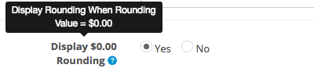

## Welcome

Thank you for purchasing Price Rounding extension!

This document contains information for **Price Rounding** extension. If this is not what you are looking for, please go back to [Documentation List](https://opencart.my/documentation).

> If you have any questions that are not found in this documentation, you may contact me through email from the [Support](#support) section at the bottom.

### Extension Info

#### Price Rounding

||
| --- |
| Download Page:                  | <https://www.opencart.com/index.php?route=marketplace/extension/info&extension_id=10016> |
| Latest Version:                 | 2.0.1 ([v1.3.x Documentation](https://opencart.my/documentation/round/)) |
| Release Date:                   | 11th March 2018 |
| Demo:                           | OpenCart v3.0.2.x: <https://demo.opencart.my/rounding> OpenCart v2.3.0.x: <https://demo.opencart.my/round> OpenCart v1.5.x: <https://demo.opencart.my/rounding/v1> |
| Author:                         | opencart.my - [More extensions](https://www.opencart.com/index.php?route=marketplace/extension&filter_member=opencart.my) |
| Contact:                        | support@opencart.my |

#### Version Compatiblity

| Price Rounding version | OpenCart version |
| --- | --- |
| 1.1 | 1.5.0, 1.5.0.1, 1.5.0.2, 1.5.0.3, 1.5.0.4, 1.5.0.5 1.5.1, 1.5.1.1, 1.5.1.2, 1.5.1.3 1.5.2, 1.5.2.1 1.5.3, 1.5.3.1 1.5.4, 1.5.4.1 1.5.5, 1.5.5.1 1.5.6, 1.5.6.1, 1.5.6.2, 1.5.6.3, 1.5.6.4 |
| 1.2 | 2.0.0.0, 2.0.1.0, 2.0.1.1, 2.0.2.0, 2.0.3.1 |
| 1.3 | 2.1.0.1, 2.1.0.2 |
| 1.3.1 | 2.2.0.0 |
| 1.3.2 ([v1.3.x Documentation](https://opencart.my/documentation/round/)) | 2.3.0.0, 2.3.0.1, 2.3.0.2 |
| 2.0.0 2.0.1 | 3.0.0.0, 3.0.1.1, 3.0.1.2, 3.0.2.0, 3.0.3.0, 3.0.3.1, 3.0.3.2, 3.0.3.3 |

## Features

### Overview

Price Rounding enables advance and precise rounding on the cart total price. Useful for rounding off price as discount or required by law in certain countries.

### Highlights

1. Can be sorted with other cart total modules such as Sub-total and Taxes.

2. Enable to set multiple rounding rules based on price range, customer groups, currencies, and many more.

3. Advance customization in rounding rules enables complete rounding control and precise price rounding.

### What's New in v2.0.1

1. Fixed rounding for multistore with multi-currencies. [See changelog](#changelog)

## Installation

### Prerequisite

1. OpenCart version must be a compatible version. Please refer to the [Version Compatiblity](#version-compatiblity) table above.

### Install

1. Login as admin to your store administration back-end.

2. Navigate to `Extensions` \> `Installer`.

  

3. Click on the `Upload` button and browse the extension file **myoc.rounding.ocmod.zip** that you have downloaded from your purchase on opencart.com marketplace.

  

4. Once `Install Progress` is successful, navigate to `Extensions` \> `Extensions` \> under `Choose the extension type` \> select **Modules**.

  

5. Under `Modules`, look for the `Module Name` **OpenCart.my Extension Installer** and check if it has been installed. Otherwise, just click on the green <button class="docute-button docute-button-success"><i class="fa fa-plus-circle"></i></button> button to install it.

6. After that, you should see the list of **OpenCart.my Extensions** automatically loaded on your page. Otherwise, just refresh the page by navigating to `Extensions` \> `Extensions` \> under `Choose the extension type` \> select **OpenCart.my Extensions**.

  

7. Under `OpenCart.my Extensions`, look for the `Module Name` **Price Rounding** and click on the green <button class="docute-button docute-button-success"><i class="fa fa-plus-circle"></i></button> button to install it.

8. After installation is successful, you may click on the blue <button class="docute-button docute-button-primary"><i class="fa fa-pencil"></i></button> button to start creating new **Price Rounding** entry. (See [Usage](#usage))

  

## Update

### From v1.x to v2.0.x

Previous versions of this extension are not compatible with OpenCart v3.0.x. Therefore, a new installation is required.

### From v2.0.0 to v2.0.1

Please follow the steps below to update **Price Rounding** extension. Your extension settings & data will not be deleted.

  Please **DO NOT** uninstall the **Price Rounding** extension from `admin` \> `Extensions` \> `Extensions` \> `OpenCart.my Extensions`, as doing so will delete all your extension settings & data.

1. Click on the `Upload` button and browse the new extension file **myoc.rounding.ocmod.zip** that you have downloaded from your purchase on opencart.com marketplace.

  

  This will replace previous extension files with the updated version.

2. Then, navigate to `Extensions` \> `Modifications` \> click on the blue <button class="docute-button docute-button-primary"><i class="fa fa-refresh"></i></button> **Refresh** button.

3. Clear your theme cache by navigating to `Dashboard` \> click on the blue <button class="docute-button docute-button-primary"><i class="fa fa-cog"></i></button> **Settings** button \> click on the orange <button class="docute-button docute-button-warning"><i class="fa fa-refresh"></i></button> **Refresh** buttons to refresh both `Theme` & `SASS` Components \> close the **Developer Settings** window.

4. If necessary, reconfigure and save the extension settings in the extension configuration page in admin > `Extensions` \> `Extensions` \> under `Choose the extension type` \> select `OpenCart.my Extensions` > `Price Rounding` > click on the blue <button class="docute-button docute-button-primary"><i class="fa fa-pencil"></i></button> **Edit** button.

## Usage

### Status

  

`Enable` or `Disable` the price rounding entry.

### Sort Order

  

Enter a numerical value to sort rounding by order. This value is related to the sort order of other **Total** modules. This means that you can sort this rounding module in any order with other **Total** modules such as `Sub-Total` and `Taxes` etc.

For example, if you want to round off price before tax is applied, then you must set the sort order of this Price Rounding lower value than `Taxes` module.

However, please make sure that Price Rounding **Sort Order** must always be higher value than `Sub-Total` module, and always be lower value than `Total` module.

### Title

  

Insert a title for the rounding entry. This title will appear in the cart total throughout the checkout process. Example titles: Rounding Adjust, Round Off, Further Discount, etc.

### Display Type

  

Set the rounding amount to be displayed in difference or total. Example:

  

### Display $0.00 Rounding

  

If set to No, rounding will be hidden when rounding value = $0.00.

### Login Required

  

If set to Yes, only logged in customer are able to see the rounding.

### Customer Group

  

Set price rounding only for selected customer group(s). Only activates if `Login Required` above is set to **Yes**.

### Store

  

Set price rounding only for selected stores.

### Currency

  

Set price rounding only for selected currencies.

### Price Range From

  

Set a starting price range where the price rounding will take effect. Value is inclusive.

### Price Range To

  

Set a maximum price range where the price rounding will take effect. Value is inclusive.

### Rounding Method

  

**Fixed** - Price will be rounded to the fixed rounding value.

**Multiple** - Price will be rounded to the multiple of rounding value.

Scroll down to see rounding examples.

### Rounding Direction

  

Rounding can be set to round up, round down, or to the nearest rounding value.

Scroll down to see rounding examples.

### Rounding Value

  

Set a rounding value. Rounding will not apply if rounding value is higher than the price total.

### Save

Once you are done, click on the blue <button class="docute-button docute-button-primary"><i class="fa fa-save"></i></button> button on the top right of the form to save your entry.

## Rounding Rules Examples

| Price Range From | Price Range To | Rounding Method | Rounding Direction | Rounding Value | Price | Rounding Difference | Rounding Total |
| --- | --- | --- | --- | --- | --- | --- | --- |
| 0.00 | 999.99 | Fixed | Up | 0.99 | 123.38 | 0.61 | 123.99 |
| 0.00 | 999.99 | Fixed | Nearest | 0.99 | 123.38 | -0.39 | 122.99 |
| 0.00 | 999.99 | Fixed | Down | 0.99 | 123.38 | -0.39 | 122.99 |
| 0.00 | 999.99 | Multiple | Up | 0.05 | 123.38 | 0.02 | 123.40 |
| 0.00 | 999.99 | Multiple | Nearest | 0.05 | 123.38 | 0.02 | 123.40 |
| 0.00 | 999.99 | Multiple | Down | 0.05 | 123.38 | -0.03 | 123.35 |
| 1000.00 | 9999.99 | Fixed | Up | 9.90 | 3456.78 | 3.12 | 3459.90 |
| 1000.00 | 9999.99 | Fixed | Nearest | 9.90 | 3456.78 | 3.12 | 3459.90 |
| 1000.00 | 9999.99 | Fixed | Down | 9.90 | 3456.78 | -6.88 | 3449.90 |
| 1000.00 | 9999.99 | Multiple | Up | 10.00 | 3456.78 | 3.22 | 3460.00 |
| 1000.00 | 9999.99 | Multiple | Nearest | 10.00 | 3456.78 | 3.22 | 3460.00 |
| 1000.00 | 9999.99 | Multiple | Down | 10.00 | 3456.78 | -6.78 | 3450.00 |

## Customization

### Custom Language

To add additional language support, please perform the following steps (assuming 'zh-cn' is the custom language folder name):

#### Admin Back-end

1. Make a copy of the following file:
`/admin/language/en-gb/extension/myoc/rounding.php`

2. Paste it into your custom language folder(you may need to create the folder `myoc` manually):
`/admin/language/zh-cn/extension/myoc/rounding.php`

3. Open and edit the newly copied file:
`/admin/language/zh-cn/extension/myoc/rounding.php`

4. Edit the text in the file to your custom language accordingly.

#### Store Front

Price Rounding extension readily supports multi languages. There's no extra modification required.

  

Just enter the relevant title for each custom language installed on your store, and it will be displayed on the cart total according to customer's selected language on the store front.

### Custom Theme

Price Rounding should work in any custom theme as it is only a cart total module and does not modify any core files or template files.

## Troubleshoot / FAQ

**Q: Extension is not showing up on cart total.**

> A1: Please make sure you have set the extension settings properly in your admin. The following settings can cause Price Rounding to not appear on cart total:

> * Status is Disabled.
> * Login Required is set to Yes but customer is not logged in on store front.
> * Required Store is not selected in Rounding Rules.
> * Required Customer Group is not selected in Rounding Rules.
> * Total price is not in range.

> Please see Usage section for detailed settings instruction.

**Q: Are the Price Range inclusive?**

> A: Yes.

## Uninstall

### Option A: Uninstall only

Please follow the steps below if you want to temporary disable **Price Rounding** extension from your store but plan to reinstall later.

1. Login as admin to your store administration back-end.

2. Navigate to `Extensions` \> `Extensions` \> under `Choose the extension type` \> select **OpenCart.my Extensions**.

3. Under `OpenCart.my Extensions`, look for the `Module Name` **Price Rounding** and click on the red <button class="docute-button docute-button-danger"><i class="fa fa-minus-circle"></i></button> button to uninstall it.

  **WARNING!** All rounding entries will be completely deleted from your store!

  

### Option B: Uninstall and delete all extension files

Please follow the steps below to completely uninstall and delete **Price Rounding** extension files from your store.

  **WARNING!** All extension files and configuration settings data will be completely deleted from your store!

1. Follow the steps above in the [Option A: Uninstall only](#option-a-uninstall-only) section to uninstall the extension.

2. In your store admin, navigate to `Extensions` \> `Installer` \> `Install History` \> under `Filename`, look for `myoc.rounding.ocmod.zip` entry and click on the red <button class="docute-button docute-button-danger"><i class="fa fa-trash-o"></i></button> button to completely delete all **Price Rounding** extension files.

  

  Please **DO NOT** uninstall and delete the `myoc.installer.ocmod.zip` entry above, as it is required for you to access all other existing OpenCart.my (myoc) extensions that you might have installed and currently in use on your store.

## Changelog

| Version | Release Date | Features |
| --- | --- | --- |
| v2.0.1 | 11th March 2018 | 1. Fixed rounding for multistore with multi-currencies |
| v2.0.0 | 22nd February 2018 | 1. Support for latest OpenCart v3.0.x |

## Support

### Questions & Troubleshooting

If you have any questions regarding this extension or require troubleshooting support, please email to `support@opencart.my`

Please include the following in your email:

1. **URL** to the page on your store or **screenshots** showing the issue or error.
2. A temporary admin login to your OpenCart store administration with full **access** & **modify** permissions.
3. A temporary **FTP login** to your store host server with read & write permission.

### Professional Service

We provide a variety of professional services for your OpenCart store.

- Extension Customization
- Extension Integration with other 3rd party extensions
- Custom Theme Integration

Please email your request to `support@opencart.my` to see how we can help you.

### Comments and Feedbacks

You can always post your comments, feedback, or any suggestion on the extension page here: <https://www.opencart.com/index.php?route=marketplace/extension/info&extension_id=10016>
