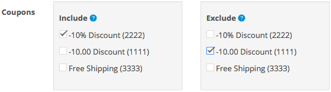
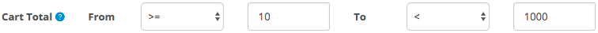

## Welcome

Thank you for purchasing Super Discount extension!

This document contains information for **Super Discount** extension. If this is not what you are looking for, please go back to [Documentation List](http://opencart.my/documentation).

> If you have any questions that are not found in this documentation, you may contact me through email from the [Support](#support) section at the bottom.

### Extension Info

#### Super Discount

|||
| --- | --- |
| Download Page:                  | <https://www.opencart.com/index.php?route=marketplace/extension/info&extension_id=21751> |
| Latest Version:                 | 2.0.0 ([v1.2 Documentation](http://opencart.my/documentation/superdiscount/v1)) |
| Release Date:                   | 30th May 2018 |
| Demo:                           | OpenCart v3.0.2.x: <http://demo.opencart.my/superdiscount2> OpenCart v2.3.0.x: <http://demo.opencart.my/superdiscount> |
| Author:                         | opencart.my - [More extensions](https://www.opencart.com/index.php?route=marketplace/extension&filter_member=opencart.my) |
| Contact:                        | support@opencart.my |

#### Version Compatiblity

| Super Discount version | OpenCart version |
| --- | --- |
| 1.1 | 2.1.0.1, 2.1.0.2 |
| 1.2 ([v1.2 Documentation](http://opencart.my/documentation/superdiscount/)) | 2.0.0.0, 2.0.1.0, 2.0.1.1, 2.0.2.0, 2.0.3.1  2.2.0.0  2.3.0.0, 2.3.0.1, 2.3.0.2 |
| 2.0.0 | 3.0.0.0, 3.0.1.1, 3.0.1.2, 3.0.2.0 |

## Features

### Overview

#### Set total discount or fees based on rules in cart

Super Discount enables store owner to setup multiple discounts or fees on the cart total based on specific rules such as Products, Categories, Customer Group, Cart Total, and many more.

### Highlights

1. Create multiple discounts or fees easily.

2. Works with any custom theme.

3. Multiple rules available such as Products, Options, Categories, Manufacturers, Customer, Customer Group, Customer's Past Order & Limit, Payment & Shipping Method, Coupons & Vouchers, Currencies, Weight, Cart Total & Cart Quantity, and Duration.

4. Mix multiple rules together.

5. Multi-languages and multi-currencies supported.

### What's New in v2.0.0

1. Support for latest OpenCart v3.0.x. [See changelog](#changelog)

2. Introduced new rules: Limit per Customer, Coupons & Vouchers, Currency, Exclude Other Super Discount, Cart Quantity.

## Installation

### Prerequisite

1. OpenCart version must be a compatible version. Please refer to the [Version Compatiblity](#version-compatiblity) table above.

### Install

1. Login as admin to your store administration back-end.

2. Navigate to `Extensions` \> `Installer`.

  

3. Click on the `Upload` button and browse the extension file **myoc.superdiscount.ocmod.zip** that you have downloaded from your purchase on opencart.com marketplace.

  

4. Once `Install Progress` is successful, navigate to `Extensions` \> `Extensions` \> under `Choose the extension type` \> select **Modules**.

  

5. Under `Modules`, look for the `Module Name` **OpenCart.my Extension Installer** and check if it has been installed. Otherwise, just click on the green <button class="docute-button docute-button-success"><i class="fa fa-plus-circle"></i></button> button to install it.

6. After that, you should see the list of **OpenCart.my Extensions** automatically loaded on your page. Otherwise, just refresh the page by navigating to `Extensions` \> `Extensions` \> under `Choose the extension type` \> select **OpenCart.my Extensions**.

  

7. Under `OpenCart.my Extensions`, look for the `Module Name` **Super Discount** and click on the green <button class="docute-button docute-button-success"><i class="fa fa-plus-circle"></i></button> button to install it.

8. After installation is successful, you may click on the blue <button class="docute-button docute-button-primary"><i class="fa fa-pencil"></i></button> button to start creating new **Super Discount** entry. (See [Usage](#usage))

  

## Update

### From v1.x to v2.0.x

Previous versions of this extension are not compatible with OpenCart v3.0.x. Therefore, a new installation is required.

## Usage

### Status

  

`Enable` or `Disable` the Super Discount entry.

### Sort Order

  

Enter a numerical value to sort Super Discount by order. This value is related to the sort order of other **Total** modules. This means that you can sort this Super Discount module in any order with other **Total** modules such as `Sub-Total` and `Taxes` etc.

For example, if you want to apply a discount before tax is applied, then you must set the sort order of this Super Discount lower value than `Taxes` module.

However, please make sure that Super Discount **Sort Order** value must always be higher than `Sub-Total` module, and always be lower than `Total` module.

### Name

  

Insert a name for the Super Discount entry. This name will appear in the cart total throughout the checkout process.

  

Example names: _My Discount, Further Discount, Special Offer, Off, Handling Fee, Packaging Fee_, etc.

### Product

Add products as rule for this discount. Any product added here will become a criteria for this discount entry. Meaning, this discount will only apply when the product together with its `quantity` & `prefix` added here matches with the products in the shopping cart.

  

#### Steps to add a product: 
1. enter a `quantity` value on the left for minimum quantity, or leave blank if no minimum quantity intended
2. select a `prefix` from the left drop-down list. If no minimum quantity intended, select **Disabled**
3. enter a `quantity` value on the right for maximum quantity, or leave blank if no minimum quantity intended
4. select a `prefix` from the right drop-down list. If no maximum quantity intended, select **Disabled**
5. `search` for a product by typing in the input search box. A drop-down box will then appear for product selection.

#### Prefix guide: 
* `=` exactly equals to 
* `<` less than 
* `<=` less than or equals to 
* `>` greater than 
* `>=` greater than or equals to

**Example:** Adding a `iPhone` product with `>=`(greater than or equals to) and minimum quantity of `1` on the left, and `>`(greater than) and maximum quantity of `10` on the right means that the shopping cart must contain **at least 1 and less than 10** `iPhone` product for this Super Discount entry to be applied to the cart total.

### Option

Add options or option values as rule for this discount. Any option added here will become a criteria for this discount entry. Meaning, this discount will only apply when the option together with its `quantity` & `prefix` added here matches with the products' options in the shopping cart.

  

#### Steps to add an option or option value:
1. enter a `quantity` value on the left for minimum quantity, or leave blank if no minimum quantity intended
2. select a `prefix` from the left drop-down list. If no minimum quantity intended, select **Disabled**
3. enter a `quantity` value on the right for maximum quantity, or leave blank if no minimum quantity intended
4. select a `prefix` from the right drop-down list. If no maximum quantity intended, select **Disabled**
5. `search` for an option or option value by typing in the input search box. A drop-down box will then appear for option selection, grouped by type of options.

#### Prefix guide:
* `=` exactly equals to 
* `<` less than 
* `<=` less than or equals to 
* `>` greater than 
* `>=` greater than or equals to

**Example:** Adding a `Checkbox 1` option with `>=`(greater than or equals to) and minimum quantity of `1` on the left, and `>`(greater than) and maximum quantity of `10` on the right means that the shopping cart must contain **at least 1 and less than 10** product that contains the selected option `Checkbox 1` for this Super Discount entry to be applied to the cart total.

### Category

Add categories as rule for this discount. Any category added here will become a criteria for this discount entry. Meaning, this discount will only apply when the category together with its `quantity` & `prefix` added here matches with the products' category in the shopping cart.

  

#### Steps to add a category:
1. enter a `quantity` value on the left for minimum quantity, or leave blank if no minimum quantity intended
2. select a `prefix` from the left drop-down list. If no minimum quantity intended, select **Disabled**
3. enter a `quantity` value on the right for maximum quantity, or leave blank if no minimum quantity intended
4. select a `prefix` from the right drop-down list. If no maximum quantity intended, select **Disabled**
5. `search` for a category or child-category by typing in the input search box. A drop-down box will then appear for category & child-category selection.

#### Prefix guide:
* `=` exactly equals to 
* `<` less than 
* `<=` less than or equals to 
* `>` greater than 
* `>=` greater than or equals to

**Example:** Adding a `Desktops` category with `>=`(greater than or equals to) and minimum quantity of 1 on the left, and `>`(greater than) and maximum quantity of 10 on the right means that the shopping cart must contain **at least 1 and less than 10** products that belong to the `Desktops` category for this Super Discount entry to be applied to the cart total.

### Manufacturer

Add manufacturers(brands) as rule for this discount. Any manufacturer added here will become a criteria for this discount entry. Meaning, this discount will only apply when the manufacturer together with its `quantity` & `prefix` added here matches with the products' manufacturer in the shopping cart.

  

#### Steps to add a manufacturer:
1. enter a `quantity` value on the left for minimum quantity, or leave blank if no minimum quantity intended
2. select a `prefix` from the left drop-down list. If no minimum quantity intended, select **Disabled**
3. enter a `quantity` value on the right for maximum quantity, or leave blank if no minimum quantity intended
4. select a `prefix` from the right drop-down list. If no maximum quantity intended, select **Disabled**
5. `search` for a manufacturer by typing in the input search box. A drop-down box will then appear for manufacturer selection.

#### Prefix guide:
* `=` exactly equals to 
* `<` less than 
* `<=` less than or equals to 
* `>` greater than 
* `>=` greater than or equals to

**Example:** Adding a `Apple` manufacturer with `>=`(greater than or equals to) and minimum quantity of 1 on the left, and `>`(greater than) and maximum quantity of 10 on the right means that the shopping cart must contain *at least 1 and less than 10* products that belong to the `Apple` manufacturer for this Super Discount entry to be applied to the cart total.

### Customer Group

  

If selected, customers under the selected Customer Group must be logged-in on your store for this Super Discount entry to be applied to the cart total.

### Customer

  

Customers added in this list must be logged-in on your store for this Super Discount entry to be applied to the cart total.

### Has Past Order

  

Customer must be logged in for Super Discount to check for customer's past orders.

If set to `Yes`, this discount will be applied to the cart total only if the logged-in customer has past orders made before in the store.

If set to `No`, this discount will be applied to the cart total only if the logged-in customer has **NEVER** made any past orders before in the store(First time order in the store).

### Limit Per Customer

  

The maximum number of times this discount can be applied to a single registered customer. Leave blank or `0` for unlimited.

Does not apply to **Guest** customer checkout.

### Geo Zones

  

Any Geo Zone selected here will become a rule for this Super Discount entry. However, this Super Discount entry will only get applied to the cart total after the customer enters their Country, Region or State, & Post Code on the cart page under `Estimate Shipping & Taxes` or on the checkout page.

### Shipping Method

  

Any Shipping method selected here will become a rule for this Super Discount entry. However, this Super Discount entry will only get applied to the cart total after customer selects a Shipping method on the cart page or on the checkout page.

### Payment Method

  

Any Payment method selected here will become a rule for this Super Discount entry. However, this Super Discount entry will only get applied to the cart total after customer selects a Payment method on the checkout page. So, customer will only see this discount(if applied) on the checkout page at the last step `Confirm` in the cart total summary table.

### Coupons

  

Any Coupon selected here will become a rule for this Super Discount entry.

For Coupons selected under the **Include** list, this Super Discount entry will only be applied when customer enters a valid Coupon code on the Shopping Cart page under `Use Coupon Code`.

For Coupons selected under the **Exclude** list, this Super Discount entry will only be applied when the Coupon code is **NOT** applied by the customer on the Shopping Cart page under `Use Coupon Code`.

Do not select any Coupons to disable Coupons rule as criteria.

### Vouchers

  

Any Voucher selected here will become a rule for this Super Discount entry. 

For Vouchers selected under the **Include** list, this Super Discount entry will only be applied when customer enters a valid Voucher code on the Shopping Cart page under `Use Gift Certificate`.

For Vouchers selected under the **Exclude** list, this Super Discount entry will only be applied when the Voucher code is **NOT** applied by the customer on the Shopping Cart page under `Use Gift Certificate`.

Do not select any Vouchers to disable Vouchers rule as criteria.

### Store

  

Any store selected here will become a rule for this Super Discount entry. This Super Discount entry will only get applied to the cart total if the current store matches with any of the selected stores here. Therefore, **at least 1** store must be selected for this Super Discount entry to be applied.

### Currency

  

Any currency selected here will become a rule for this Super Discount entry. This Super Discount entry will only get applied to the cart total if the current store currency matches with any of the selected currencies here. Therefore, **at least 1** currency must be selected for this Super Discount entry to be applied.

### Exclude Other Super Discount

  

Exclude other Super Discount entries to prevent multiple Super Discount entries from overlapping. 

**Note:** The selected Super Discount entries must have a lower **Sort Order**(higher value) than this current Super Discount entry for it to work correctly. Because the cart total can only check existing Super Discount entries that are already in the cart total.

**Example:** The `My Discount` entry in the screenshot has a **Sort Order** value of `10`, this current Super Discount entry must have a **Sort Order** value lower than `10`, e.g. `9` and below. So when both Super Discount entries matches the rules, only this current Super Discount entry will get applied to the cart total, while the selected `My Discount` entry will not be applied.

### Weight

  

Set a weight value as a rule for this Super Discount entry. Remember to specify the weight **unit** on the right most drop-down list. Value will be automatically converted for calculations if unit is different.

#### Prefix guide:
* `=` exactly equals to 
* `<` less than 
* `<=` less than or equals to 
* `>` greater than 
* `>=` greater than or equals to

**Example:** `>=` `5` `kg` means that the total cart items' weight must be **at least 5 kg or more** for this Super Discount entry to be applied to the cart total.

### Cart Total

  

Set a cart total value or range value as a rule for this Super Discount entry. The preceding cart total value for this Super Discount entry to be applied on will depend on the **Sort Order** of this Super Discount entry.

#### Prefix guide (From): 
* `Disabled` Please set to **Disable** if not using cart total as criteria. 
* `=` exactly equals to
* `>` greater than
* `>=` greater than or equals to

#### Prefix guide (To): 
* `Disabled` Please set to **Disable** if not using the high value as criteria. 
* `<` less than
* `<=` less than or equals to

**Examples:** 

1. (**From** `>=` `100`, **To** `Disabled`) means that this Super Discount entry will only be applied if the cart total value is **at least $100 or more** in value.
2. (**From** `>=` `100`, **To** `<` `900`) means that this Super Discount entry will only be applied if the cart total value is **between the range of $99 and $900** in value.

### Cart Quantity

  

Set a cart total quantity or range quantity as a rule for this Super Discount entry.

#### Prefix guide (From): 
* `Disabled` Please set to **Disable** if not using cart total as criteria. 
* `=` exactly equals to
* `>` greater than
* `>=` greater than or equals to

#### Prefix guide (To): 
* `Disabled` Please set to **Disable** if not using the high value as criteria. 
* `<` less than
* `<=` less than or equals to

**Examples:** 

1. (**From** `>=` `10`, **To** `Disabled`) means that this Super Discount entry will only be applied if the cart contains **at least 10 items and above** in total.
2. (**From** `>=` `1`, **To** `<` `10`) means that this Super Discount entry will only be applied if the cart contains **at least 1 item and less than 10 items** in total.

### Price

  

Set a discount(-negative) or fee(+positive) when all the rules are met.

#### Prefix guide:
* `=` set the cart total equal to the price value
* `+` add a fixed fee
* `-` discount or less a fixed price
* `+%` add a fee based on a percentage of the cart total
* `-%` discount or less based on a percentage of the cart total

**Example:** `-% 25` means apply a **25% discount less** to the cart total.

### Duration

  

Set a **start** date & **end** date for this Super Discount entry to be active.

### Save

Once you are done, click on the blue <button class="docute-button docute-button-primary"><i class="fa fa-save"></i></button> button on the top right of the form to save your entry.

### Testing

Test your Super Discount entry rules by adding the relevant products to cart on your store front end. The Super Discount entry should appear as one of the **Cart Total** item as such:

## Customization

### Custom Language

To add additional language support, please perform the following steps (assuming `zh-cn` is the custom language folder name):

#### Admin Back-end

1. Make a copy of the following file:
`/admin/language/en-gb/extension/myoc/super_discount.php`

2. Paste it into your custom language folder(you may need to create the folder `myoc` manually):
`/admin/language/zh-cn/extension/myoc/super_discount.php`

3. Open and edit the newly copied file:
`/admin/language/zh-cn/extension/myoc/super_discount.php`

4. Edit the text in the file to your custom language accordingly.

#### Store Front

Super Discount extension readily supports multi languages. There's no extra modification required.

  

Just enter the relevant name for each custom language installed on your store, and it will be displayed on the cart total according to customer's selected language on the store front.

### Custom Theme

Super Discount should work in any custom theme as it is only a cart total module and does not modify any core files or template files.

## Troubleshoot / FAQ

**Q: Extension is not showing up on cart total.**

> A1: Please make sure you have set the extension settings properly in your admin. The following settings can cause Super Discount to not appear on cart total:

> * Status is Disabled.
> * Customer Group is selected but customer is not logged in on store front.
> * Required Store is not selected.
> * Required Currencies is not selected.
> * Cart Total price is not in range.

> Please see Usage section for detailed settings instruction.

## Uninstall

### Option A: Uninstall only

Please follow the steps below if you want to temporary disable **Super Discount** extension from your store but plan to reinstall later.

1. Login as admin to your store administration back-end.

2. Navigate to `Extensions` \> `Extensions` \> under `Choose the extension type` \> select **OpenCart.my Extensions**.

3. Under `OpenCart.my Extensions`, look for the `Module Name` **Super Discount** and click on the red <button class="docute-button docute-button-danger"><i class="fa fa-minus-circle"></i></button> button to uninstall it.

  **WARNING!** All Super Discount entries will be completely deleted from your store!

  

### Option B: Uninstall and delete all extension files

Please follow the steps below to completely uninstall and delete **Super Discount** extension files from your store.

  **WARNING!** All extension files and configuration settings data will be completely deleted from your store!

1. Follow the steps above in the [Option A: Uninstall only](#option-a-uninstall-only) section to uninstall the extension.

2. In your store admin, navigate to `Extensions` \> `Installer` \> `Install History` \> under `Filename`, look for `myoc.superdiscount.ocmod.zip` entry and click on the red <button class="docute-button docute-button-danger"><i class="fa fa-trash-o"></i></button> button to completely delete all **Super Discount** extension files.

  

  Please **DO NOT** uninstall and delete the `myoc.installer.ocmod.zip` entry above, as it is required for you to access all other existing OpenCart.my (myoc) extensions that you might have installed and currently in use on your store.

## Changelog

| Version | Release Date | Features |
| --- | --- | --- |
| v2.0.0 | 30th May 2018 | 1. Support for latest OpenCart v3.0.x |

## Support

### Questions & Troubleshooting

If you have any questions regarding this extension or require troubleshooting support, please email to `support@opencart.my`

Please include the following in your email:

1. **URL** to the page on your store or **screenshots** showing the issue or error.
2. A temporary admin login to your OpenCart store administration with full **access** & **modify** permissions.
3. A temporary **FTP login** to your store host server with read & write permission.

### Professional Service

We provide a variety of professional services for your OpenCart store.

- Extension Customization
- Extension Integration with other 3rd party extensions
- Custom Theme Integration

Please email your request to `support@opencart.my` to see how we can help you.

### Comments and Feedbacks

You can always post your comments, feedback, or any suggestion on the extension page here: <https://www.opencart.com/index.php?route=marketplace/extension/info&extension_id=21751>
